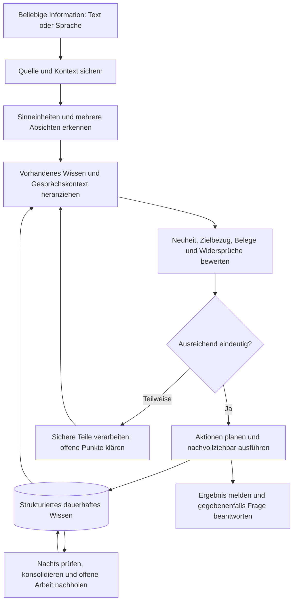
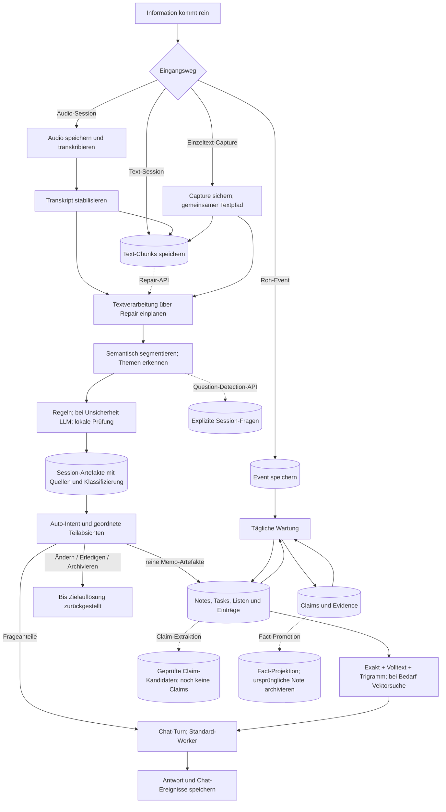
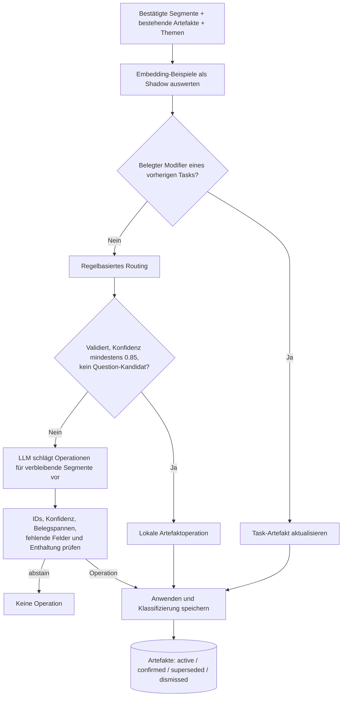
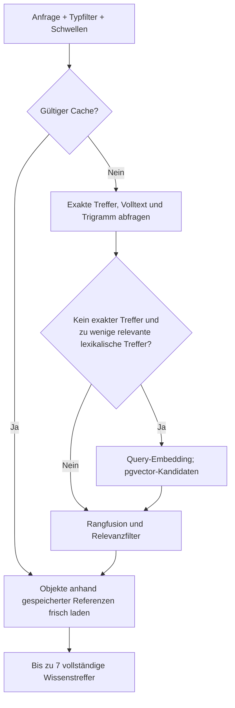
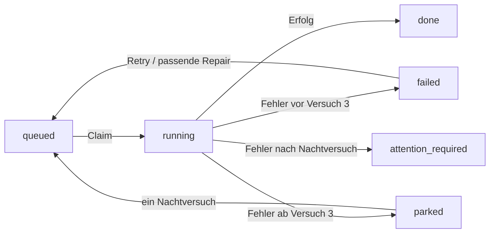

# Smart Notebook – Logik der Verarbeitung und des Wissens

Stand der Zusammenführung: **2026-09-11**. Grundlage: lokaler Quellcode, bestehende Projektdokumentation und das Gespräch über einen allgemeinen Auto-Modus.

Fachliche Ergänzung vom **2026-09-08**: Die Produktentscheidungen zu Aufnahmefilter, langfristiger Wissensverdichtung, Facts, Konfliktklärung, Dashboard-Rückfragen und Archivierung wurden vom Nutzer bestätigt. Die entsprechend markierten Abschnitte beschreiben beschlossenes Soll-Verhalten; sie sind kein Nachweis seiner Implementierung.

## 1. Zweck, Geltungsbereich und Lesereihenfolge

Dieses Dokument erklärt, was mit einer Information geschieht: vom Eingang über Verstehen, Einordnen und Bewerten bis zu einer Aktion, einer Antwort und der späteren Konsolidierung. Es ist der zentrale fachliche Einstieg in das Backend. Es beschreibt auch die noch fehlenden Verbindungen zum gewünschten Auto-Modus.

Die Beschreibung beruht auf einer **statischen Prüfung von Code und Aufrufstellen**. Sie ist kein Nachweis einer laufenden Serverinstallation und keine erneute Abnahme der vorhandenen Tests. Aussagen aus älteren Dokumenten und dem Chat wurden nicht ungeprüft übernommen.

Die bestehenden API-Verträge und Architekturentscheidungen bleiben bestehen. Dieses Dokument erfindet keine neuen Endpoints, ändert keine Wire-Semantik und erklärt Implementierungsabweichungen nicht stillschweigend zu neuen Produktentscheidungen. Widersprüche stehen in Abschnitt 19. Historische Dokumente bleiben als Herkunftsnachweis erhalten.

### Inhaltsübersicht

1. Zweck und Statusbegriffe
2. Zielbild des allgemeinen Auto-Modus
3. Logische Gesamtübersicht des Ist-Stands
4. Entitäten und Speicherbeziehungen
5. Eingangswege und ihre unterschiedlichen Folgen
6. Audio, Text-Chunks und Session-Verarbeitung
7. Klassifizierung, Themen und Artefaktaktionen
8. Finalisierung und Übernahme in dauerhaftes Wissen
9. Suche, Deduplication und Wiederverwendung
10. Chat und Antworten
11. Evidence, Claims und Facts
12. Questions, implizite Fragen und Clarifications
13. Konfidenz, Relevanz, Importance und Priorität
14. Änderungen, Erledigung, Archivierung und CalDAV
15. Nächtliche Konsolidierung in tatsächlicher Reihenfolge
16. Worker, Fehler, Wiederaufnahme und Reihenfolgegarantien
17. Dashboard, Offline-Sync, Push und Betrieb
18. Fehlende Verbindungen zum Auto-Modus und Abnahmeszenarien
19. Widersprüche und Präzisierungen
20. Quellenregister, Prüfung und Pflege

### Statusbegriffe

| Kennzeichnung | Bedeutung |
|---|---|
| **Automatisch im Pfad** | Der vorhergehende Schritt ruft diesen Schritt auf oder legt den passenden Auftrag an. Ein benötigter Worker muss tatsächlich laufen. |
| **Separat aufrufbar** | Implementierung und API/Funktion existieren, aber die zentrale Verarbeitung ruft sie nicht generell auf. |
| **Shadow / Kandidat** | Ergebnisse werden zur Prüfung gespeichert; daraus folgt keine entsprechende Mutation des dauerhaften Wissens. |
| **Ziel / offen** | Gewünschtes Verhalten aus diesem Gespräch oder einer Planung, für das noch keine durchgängige Implementierung gefunden wurde. |
| **Beschlossen / Umsetzung offen** | Vom Nutzer bestätigte fachliche Regel. Die Produktentscheidung ist getroffen; Code und gegebenenfalls Clientvertrag müssen noch angepasst werden. |

Ein registriertes KI-Taskprofil, ein Datenbankfeld, ein API-Endpunkt oder ein abgehakter Roadmap-Punkt beweist allein keine automatische Integration.

## 2. Zielbild: Ein Auto-Eingang für beliebige Informationen

Der gewünschte Auto-Modus nimmt beliebigen Text oder Sprache entgegen: zufälliges Wissen, persönliche Angaben, Memos, Notizen, Aufgaben, Listen, Korrekturen, Erledigungen und Fragen. Eine Eingabe darf mehrere davon enthalten. Der Nutzer soll die fachlichen Typen nicht vorher auswählen müssen.

**Memo** bezeichnet dabei eine Erfassungsabsicht ohne erwartete direkte Gesprächsantwort. Es ist keine zusätzliche dauerhafte Wissensentität. Ein Memo kann mehrere Notes, Tasks, Listeneinträge oder Fragen enthalten. Eine knappe Verarbeitungsbestätigung ist davon unabhängig und im beschlossenen Soll vorgesehen.

Der angestrebte Ablauf lautet:

**Dieses Diagramm ist das Zielbild, nicht die Behauptung einer bereits vollständigen Auto-Pipeline.** Der aktuelle Code besitzt mehrere Eingangswege und viele passende Bausteine. Die fehlende gemeinsame Steuerung wird in Abschnitt 18 konkretisiert.

### 2.1 Beschlossen: Niedrige Aufnahmeschwelle und langfristige Wissensverdichtung

**Status: Beschlossen / Umsetzung offen.** Der Auto-Modus soll möglichst viel nützlichen Inhalt erkennen, aber nicht jeden Satz als dauerhaftes Wissen behandeln. Dafür gelten zwei getrennte Ebenen:

1. **Aufnahmefilter:** Smalltalk, Füllsätze und reine Gesprächsorganisation werden als Wissensinhalt ausgesiebt. Die Schwelle für möglicherweise nützliche Informationen bleibt niedrig. Solche Inhalte dürfen zunächst Kandidaten sein, ohne schon als gesicherte Facts zu gelten. Zitate, Hypothesen, Meinungen und Angaben anderer Personen werden mit ihrem jeweiligen Kontext gekennzeichnet.
2. **Langfristige Verdichtung:** Schwache Evidence, niedrige Importance und lange ausbleibende Nutzung werden gemeinsam bewertet. Wenig tragfähige Inhalte werden aus der aktiven Auswahl zurückgenommen und anschließend gegebenenfalls archiviert. Neue Belege, Bestätigungen und tatsächliche Nutzung können ihre aktive Relevanz erhalten oder erneuern.

Seltene Nutzung allein rechtfertigt keine Archivierung. Explizite Merkaufträge, wichtige persönliche Angaben wie Allergien, wichtige Entscheidungen und offene Verpflichtungen werden vor rein nutzungsbasierter Bereinigung geschützt. Wiederholungen derselben Quelle erhöhen nicht automatisch die Zahl unabhängiger Belege.

Die Aufnahmeschwelle und die langfristige Bereinigung sind getrennt zu kalibrieren. Konkrete Zahlenwerte sind Implementierungs-/Evaluationsarbeit, keine noch ausstehende Grundsatzentscheidung des Nutzers. Die Regeln für Archivierungsgründe und Wiederaufnahme stehen in Abschnitt 14.3; der Anschluss an die Nachtwartung in Abschnitt 15.4.

## 3. Logische Gesamtübersicht des implementierten Stands

Durchgezogene Pfeile zeigen vorhandene Aufrufe oder Datenflüsse. Gestrichelte Pfeile markieren einen gesonderten Auslöser. Sie bedeuten nicht, dass eine Funktion fehlt.

Das Backend verwendet FastAPI als API-Schicht und PostgreSQL als autoritativen Datenbestand. PostgreSQL enthält auch Jobs, Zustände und Suchindizes. Audio-Bytes liegen separat im Dateispeicher. Embeddings sind abgeleitete Suchrepräsentationen, keine unabhängige Wissensquelle. Ein zusätzlicher Broker oder Suchcluster ist für diese Abläufe nicht eingebunden.

## 4. Welche Entitäten es gibt und wie sie zusammenhängen

### 4.1 Quellen, Arbeitsgedächtnis und dauerhaftes Wissen

| Ebene / Entität | Input und Bedeutung | Gespeichertes Ergebnis / Nutzung |
|---|---|---|
| `events` | Einzelner Rohtext, Zeit, Herkunft, gegebenenfalls `client_event_id` | Ursprüngliche Mitteilung; Capture-Ergebnis und optional Legacy-Chatantwort. Noch kein geprüftes Wissen. |
| `client_text_captures` | Capture-ID, Modus, Inhalt, `context_ref` | Routingentscheidung, verknüpfte Client-/Ingestion-Session, Status und Ergebnis. |
| `client_sessions` | Öffentliche Client-ID, Aufnahmeart, Kontext, Sequenzbasis | Geräte-/Uploadzustand, Verbindung zur Ingestion-Session und sessionsweite Audiofreigabe. |
| `ingestion_sessions` | Zusammengehörige Aufnahme oder Texteingabe | Fachlicher Container mit Anfang, Ende und Verarbeitungszustand. |
| `audio_chunks` | Audio-Bytes und Transportmetadaten | Metadaten, relativer Dateischlüssel, Hash, Status, Retention. |
| `transcript_windows`, `transcript_segments` | STT-Ergebnisse mit Zeitbezug | Vorläufige, bestätigte oder ersetzte Texthypothesen. |
| `ingestion_chunks` | Stabiler Transkripttext oder direkt eingespeister Text | Geordnete Texteingaben für semantische Verarbeitung; nicht identisch mit Audio-Transport-Chunks. |
| `semantic_segments` | Ein Chunk und vorheriger Kontext | Einzelne Sinneinheiten mit Typ, Konfidenz und Status. |
| `session_artifacts` | Interpretierte Segmente | Veränderbare Note-/Task-/List-/List-Item-/Fact-/Decision-Kandidaten der Session. |
| `artifact_classifications` | Regel- oder LLM-Entscheidung nach dem gemeinsamen Typvertrag in `content_types.py` | Belegspannen, normalisierte Felder, Gründe, fehlende Felder, `validated`, `abstained`; `question` ist hier eine Klassifikation, aber kein `session_artifact`. |
| `session_intent_decisions` | Vollständiger stabilisierter Text plus semantischer Kontext bei `auto` | Primäre Absicht, Zielhinweis und Kennzeichen für mehrere unabhängige Absichten. |
| `session_intent_parts` | Gemischte `auto`-Eingabe | Geordnete Teilabsichten mit exakter Unicode-Zeichenspanne, Intent, Zielhinweis und Konfidenz. |
| `knowledge_preflight_assessments` | Bestätigtes Artefakt oder zurückgestellte Mutationsabsicht | Idempotenter A05-Abgleich mit Suchkandidaten, bezogenen Kandidatenschlüsseln und `new|identical|complementary|contradictory|targeted`; noch keine Zielauflösung oder Mutation. |
| `mutation_target_resolutions` | A05-Abgleich plus Mutations-Intentteil und optionaler öffentlicher Objektkontext | Idempotente A06-Zielbindung als `resolved|ambiguous|unresolved`, Konfidenz, kontrollierte Gründe und bei Klärungsbedarf der Link zur offenen Frage; noch keine Mutation. |
| `mutation_action_executions` | Eindeutig aufgelöstes A06-Ziel plus Mutations-Intentteil | Persistenter A07-Aktionsplan, Zustand, Konfidenz, Gründe, Fehler-/Rückfragelink und bei Ausführung atomarer Vorher-/Nachher-Stand. |
| `session_topics` | Expliziter oder semantisch erkannter Kontext | Themen der laufenden Session samt Belegen und Konfidenz. |
| `session_questions` | Explizite oder gesondert angelegte implizite Frage | Offene/beantwortete Frage mit Priorität, Quellen und Antwort. |
| `notes` | Dauerhaft gespeicherter Inhalt | Persönliche Notiz mit Embedding, Zeitpunkten und Archivstatus. |
| `tasks` | Handlung / Verpflichtung | Inhalt, Status, persistentes Bearbeitungsfenster (`work_start_at`/`due_at`), Urgency, CalDAV-Priority, Fortschritt und Embedding. |
| `lists`, `list_items` | Container und einzelne Einträge | Veränderliche Sammlung; Einträge mit Status und Listenbezug. |
| `claims` | Atomare Aussage mit Subjekt, Prädikat und Wert | Fact, Opinion, Prediction, Requirement oder Decision; Polarität, Modalität, Gültigkeit, Konfidenz und Konfliktstatus. |
| Fact | Ein Claim mit `claim_type='fact'` | Eigene Client-Wissensprojektion aus Claims; keine separate allgemeine `facts`-Tabelle. |
| `knowledge_topics` | Dauerhafte Themen | Verbindungen, Aliasse und Themenrelationen zum Wissensbestand. |
| `knowledge_activity`, `knowledge_signals` | Nutzung und Aktivierung von Entitäten | Importance-, Aktualitäts- und Trendsignale. |
| `client_conversations`, Nachrichten und Turns | Online-Unterhaltung | Nutzer-/Assistant-Nachrichten, Turnstatus und persistierte SSE-Ereignisse. |

### 4.2 Quellen und Beziehungen sind eigene Daten

| Beziehung | Zweck |
|---|---|
| `knowledge_sources` | Verknüpft dauerhaftes Wissen mit Events, etwa als ursprüngliche oder unterstützende Quelle. |
| `session_artifact_sources` | Verbindet ein Artefakt mit den zugrunde liegenden semantischen Segmenten. |
| `session_intent_part_segments` | Bindet jede Teilabsicht an die tatsächlich gelieferten semantischen Quellsegmente. |
| `evidence_quotes` | Konkrete Textstelle aus einem Chunk mit Zeichenposition und gegebenenfalls angenähertem Audiozeitbezug. |
| `artifact_knowledge_links` | Verbindet ein promoviertes Artefakt mit dem dauerhaft gespeicherten Objekt; verhindert erneute reguläre Promotion desselben Artefakts. |
| `artifact_claim_links`, `claim_evidence` | Ordnen strukturierte Aussagen und unterstützende/widersprechende Belege zu. |
| `evidence_sources` | Quellenidentität und beschreibende Qualitäts-/Herkunftsmerkmale. |
| `claim_relations`, `conflict_cases` | Beziehungen zwischen Aussagen und dokumentierte Widersprüche. |
| `knowledge_topic_links` | Direkte oder geerbte thematische Zuordnung; Herkunft bleibt unterscheidbar. |
| `knowledge_supersessions` | Erhält die Verbindung von einem konsolidierten Original zum kanonischen Eintrag. |
| `note_fact_promotions` | Dokumentiert die Überführung einer Note in die Darstellung eines bereits vorhandenen Fact-Claims. |

Eine Quelle, ein Zitat und die daraus extrahierte Aussage sind unterschiedliche Objekte. Ebenso sind ein bestätigtes Artefakt, eine gespeicherte Note und ein belegter Fact nicht austauschbar. Nicht jeder Eingangsweg erzeugt automatisch alle diese Beziehungen.

## 5. Eingangswege: Welcher Input startet welchen Ablauf?

### 5.1 Übersicht

| Eingang / Auslöser | Input | Unmittelbare Verarbeitung | Output / Folge |
|---|---|---|---|
| `POST /api/events` und Batch | Eventtext, Herkunft, optionale stabile Client-ID | Speichern / identischen Retry erkennen | Event; weder Extraktion noch Antwort. |
| `POST /api/capture`, Capture-Batch oder Capture eines vorhandenen Events | Eventdaten / Event-ID | Event → `process_stored_event_capture` → Klassifizierung und Mutation, sofern noch nicht verarbeitet | Event plus persistiertes Capture-Ergebnis. |
| `POST /api/message` | `text` | Event → Capture → Wissenssuche → Antwort → `events.response` speichern | Antwort, Capture-Ergebnis und Debugdaten im Legacy-Endpunkt. |
| `POST /api/client/v1/captures` | `client_capture_id`, `mode`, `content`, optional `context_ref` | Idempotenz prüfen; Event, text-only Client-/Ingestion-Session, Chunk und Textjob anlegen | Capture `processing`; nach gemeinsamer Interpretation inhaltliche Intententscheidung und bei Query Conversation/Turn. |
| Client-Conversation / weiterer Turn | Stabile Nachrichten-/Turn-IDs und Inhalt | Nachrichten und Turn speichern | Turn `queued`; noch keine generierte Antwort. |
| Client-Audio-Session | Session-ID, `capture_mode`, Audio-Chunks | Audio-/Session-Pipeline | Transkripte, Segmente, Artefakte, später Capture-Ergebnis. |
| Direkte Ingestion-Text-Session | Session und geordnete Text-Chunks | Chunks speichern | Für die Weiterverarbeitung ist zusätzlich Jobanlage/Repair nötig. |

### 5.2 Heutiger Auto-Modus

1. Inhalt trimmen; Hash aus Modus, Inhalt und Kontext bilden.
2. Existiert die Capture-ID bereits mit identischen Daten, vorhandenes Capture zurückgeben. Abweichende Daten führen zum Konflikt.
3. Bei `mode != auto` bleibt der ausdrücklich gewählte Modus unverändert.
4. Event mit Herkunft `client_text_capture` und Capture zunächst `queued` speichern. Während `processing` bleibt `resolved_intent` aus Vertragskompatibilität ein vorläufiger Memo-/Query-Hinweis; er ist keine fachliche Entscheidung und wird beim Abschluss ersetzt.
5. Unter einer deterministisch aus der Capture-ID abgeleiteten internen UUID eine text-only Client-Session samt Ingestion-Session und genau einem idempotenten Chunk anlegen. Diese interne Session wird aus den Client-Sessionlisten und damit aus dem ESP-Verlauf ausgeblendet. Session-Repair erzeugt den Textjob; der geschlossene Uploadhorizont ist mangels Audio `final_sequence=0`.
6. Das Capture steht während Text- und Artefaktverarbeitung auf `processing`. Fehlerhafte beziehungsweise geparkte Jobs erscheinen bei der Statusabfrage als `attention_required`; nach Repair wieder als `processing`.
7. Erst nachdem alle Verarbeitungsjobs abgeschlossen sind, erhält `capture_intent.py` den vollständigen stabilisierten Text, die semantischen Segmente und die Session-Artefakte. Ein strikt validierter strukturierter Aufruf bestimmt `memo`, `query`, `change`, `complete` oder `archive`, dazu Zieltyp, exakte Zieltextspanne, Sicherheit, kontrollierte Gründe und das Kennzeichen für mehrere unabhängige Absichten. Die Entscheidung wird genau einmal pro Ingestion-Session in `session_intent_decisions` persistiert.
8. Bei mehreren unabhängigen Absichten zerlegt ein zweiter strukturierter Schritt den vollständigen Input in höchstens zwölf lückenlos geordnete, nicht überlappende Quellspannen. Jede Spanne wird lokal gegen den Originaltext und ihre vorhandenen semantischen Segment-IDs geprüft und in `session_intent_parts`/`session_intent_part_segments` gespeichert. Bei einer einzelnen Absicht entsteht ohne zusätzlichen LLM-Aufruf genau ein Teil über den gesamten Text.
9. A05 gleicht vorgesehene Anlagen und Mutationsteile über den hybriden Wissenszugriff ab. Nur Artefakte, deren Quellsegmente ausschließlich zu `memo`-Teilen gehören, dürfen anschließend in die bestehende Promotion. Frageanteile werden in Quellreihenfolge zu genau einem Query-Turn verbunden; bei einer gemischten Eingabe enthält dieser nicht den Memo- oder Mutationstext.
10. A06 filtert die persistierten Mutationskandidaten nach Intent und Zieltyp. Ein gültiger expliziter öffentlicher Objektkontext hat Vorrang; sonst wählt ein streng strukturierter Modellschritt nur bei hinreichend eindeutiger Zuordnung ein Ziel. Fehlende, mehrdeutige, inkompatible oder unter `0.85` bewertete Referenzen erzeugen eine persistierte implizite Rückfrage mit den Quellsegmenten. Interne Ziel-IDs und Kandidatenschlüssel werden nicht ausgegeben.
11. A07 bildet für jedes eindeutig aufgelöste Ziel genau einen persistierten Aktionsdatensatz. `complete` und `archive` werden regelbasiert auf die zulässige Objektoperation abgebildet; `change` erhält einen strikt strukturierten Plan. Neue Werte müssen exakte Quelltextspannen sein und mindestens `0.85` erreichen, sonst entsteht statt einer Mutation eine quellgebundene Rückfrage. Jede Aktion sperrt Ziel und Aktionszeile, schreibt Objektänderung sowie Vorher-/Nachher-Audit in derselben Transaktion und wird bei Wiederholung nicht doppelt ausgeführt. Das öffentliche Ergebnis meldet `completed|pending_clarification|failed|pending_execution`, aber keine internen Ziel-IDs, Payloads oder Auditstände. Das Capture meldet die erfolgreiche Zerlegung als `interpretation_status=split_completed`.
12. A08 bewertet die Sicherheit je Intentteil statt nur für die gesamte Eingabe. Tentative Mutationssprache wie „vielleicht“ bleibt unter der Teilfreigabeschwelle `0.85` und erzeugt eine bestätigende, quellgebundene Rückfrage; unabhängige sichere Geschwister laufen weiter. Das öffentliche Ergebnis enthält pro Mutationsteil einen abgeschirmten Outcome und meldet bei gemischtem Abschluss `action_status=partially_completed`.

**Grenze:** A08 trennt unabhängige sichere und unsichere Mutationsteile, beantwortet aber keine Rückfrage und setzt deren zurückgestellte Aktion noch nicht fort; das bleibt W05. Ein vollständiger allgemeiner Recovery-/Nachtlauf über Capture-, Chat- und Promotionsfehler bleibt A11/W06. Archivieren ist fachlich reversibel und kein physisches Löschen.

`context_ref` wird gespeichert und gehört zur Capture-Identität. A06 versteht einen gültigen Kontext vom Typ `note|task|list|list_item` als ausdrücklichen Objektbezug. Der getrennte Kontexttyp `clarification` bindet Audio- und Textantworten inzwischen an genau eine öffentliche Frage. Für A06/A07-Mutationsfragen wird der bestehende Kandidatensnapshot erneut bewertet und nur der abhängige Teil fortgesetzt; die allgemeinere Neubewertung von Wissen bei Nicht-Mutationsfragen bleibt in W05 offen.

### 5.3 Verarbeitung eines direkten Text-Captures

**Auslöser:** Normalerweise bereits `create_capture`. `run_capture_once`, erreichbar über `POST /api/workers/client-capture/run-once` und Bestandteil von `worker.py all`, ist nur noch der Kompatibilitäts-/Recovery-Einstieg für alte oder zwischen Persistierung und Pipelineanlage unterbrochene `queued`-Captures.

| Reihenfolge | Input | Verarbeitung | Output |
|---|---|---|---|
| 1 | Neues oder wiederaufgenommenes Capture | Stabile Capture-Identität und Inhalts-Hash prüfen | Identischer Retry oder Konflikt bei abweichenden Daten. |
| 2 | Inhalt und Erfassungszeit | Client-/Ingestion-Session und einen geordneten Text-Chunk anlegen | Dieselbe technische Textquelle wie ein stabilisiertes Transkript. |
| 3 | Text-Chunk | Session-Repair erzeugt idempotent Step und `text_processing`-Job | Persistente, vom Standardworker ausführbare Arbeit. |
| 4 | Text- und Artefaktworker | Segmentierung, Topics, Regeln/LLM und Artefakte wie im Audio-Sessionpfad | Quellengebundene Session-Artefakte. |
| 5 | Abschlussbarriere | Fachlich finalisieren und promoten; danach Capture-Ergebnis materialisieren | `completed` oder sichtbarer Aufmerksamkeits-/Fehlerzustand. |

Der frühere direkte Ein-Aktionspfad über `capture.py::process_capture_action` wird von Client-Text-Captures nicht mehr benutzt. Der deterministische Regressionstest führt Text und Audioquelle durch dieselben Worker und vergleicht ihre Segmente und Artefakte. Die anschließende inhaltliche Intententscheidung und Mehrfachzerlegung sind ebenfalls quellunabhängig; der allgemeine Vorab-Abgleich bleibt A05.

## 6. Audio und Session-Verarbeitung

### 6.1 Aufnahme und Transport

**Input:** Client-Session und Audiosegmente mit Sequenz, Client-Chunk-ID, Zeitbereich, Dauer, MIME-Typ und Hash.

1. Client-Identität und unveränderliche Sessionparameter prüfen. Die deklarierte `sequence_base` erlaubt eine Übersetzung zwischen Client-Zählung und interner, bei 1 beginnender Audiosequenz.
2. Upload-Identität und Hash prüfen. Gleiche Identität mit abweichenden Daten ergibt einen Konflikt.
3. Unveränderte Bytes in eine temporäre Datei schreiben, `flush` und `fsync` ausführen und atomar an den endgültigen Ort verschieben.
4. Metadaten und relativen `storage_key` in PostgreSQL speichern. Bei fehlgeschlagenem Metadaten-Insert wird die gerade erzeugte Datei entfernt.
5. Durable ACK zurückgeben. Es bestätigt Speicherung, nicht Transkription, semantische Verarbeitung oder Wissenspromotion.
6. Sobald ein geeignetes vollständiges Live-Fenster vorliegt, einen idempotenten STT-Auftrag anlegen.

Dateischreiben und Datenbank-Commit sind keine gemeinsame atomare Transaktion. Der Mechanismus bietet persistente Speicherung und Fehlerbehandlung, keine pauschale Garantie gegen jede Absturzkonstellation.

### 6.2 STT-Fenster und Transkriptstabilisierung

| Schritt | Input | Verarbeitung | Output |
|---|---|---|---|
| Fensterbildung | Audio-Chunks 1–3, dann 3–5, dann 5–7 usw. | Bis zu drei Transport-Chunks mit einem überlappenden Chunk | Bei ungefähr 10 Sekunden je Chunk ungefähr 30 Sekunden STT-Kontext. |
| Normalisierung | Originaldateien eines Fensters | FFmpeg fügt Dateien zusammen und erzeugt temporäres WAV, mono, 16 kHz | Abgeleitete STT-Eingabe; Original-Uploads bleiben unverändert. |
| Transkription | WAV und Sprach-/Modellparameter | Konfigurierter selbstgehosteter STT-Dienst; produktiv `ocean`-Modus | Text, Segment-/Wortzeitinformationen und STT-Metadaten. |
| Speicherung | STT-Antwort | Fenster und Segmente zunächst `provisional` speichern | Versionierbare Texthypothesen. |
| Überlappung | Neue und alte, zeitlich überlappende vorläufige Segmente | Textähnlichkeit prüfen; passende Hypothesen ersetzen; bloße Zeitüberlappung reicht nicht | `superseded`-Beziehungen statt stiller Überschreibung. |
| Stabilisierung | Zusammenhängend vorliegende Fenster | Normalerweise den letzten instabilen Rand zurückhalten; am geschlossenen Ende final stabilisieren | `confirmed`-Transkriptsegmente. |
| Fortsetzung | Bestätigter Text und naher vorläufiger Folgesatz | Unter begrenzten Regeln Satzfortsetzung zusammenführen, etwa bei kleingeschriebenem Beginn | Zusammenhängender Text statt abgeschnittener Notiz. |
| Materialisierung | Noch nicht materialisierte stabile Segmente | `ingestion_chunks` mit eigenen Sequenzen anlegen; Verweise zurückschreiben | Textinput für die semantische Verarbeitung. |
| Jobanlage | Neue stabile Chunks | `repair_ingestion_session_record` aufrufen | Fehlende Textverarbeitungsschritte und Jobs. |

Kurze Restfenster werden beim Finish eingeplant. Die Fensterlänge folgt der Chunkanzahl; 30 Sekunden sind keine für alle Clientprofile erzwungene Konstante.

**Die rohe direkte Ingestion-Text-API unterscheidet sich hier weiterhin:** `create_ingestion_chunk_record` speichert den Chunk, legt selbst aber keinen Textjob an. Dafür muss Repair oder eine passende explizite Jobanlage ausgelöst werden. Der öffentliche Client-Text-Capture ruft diesen Repair seit A01 selbst auf; im Audio-Stabilisierungspfad ist der Anschluss ebenfalls vorhanden.

### 6.3 Semantische Segmentierung

**Auslöser:** Text-Worker beansprucht einen `text_processing`-Job.

1. Aktuellen Chunk und den vorherigen Chunk laden; bis zu 750 Zeichen vorherigen Kontexts berücksichtigen.
2. Im produktiven Modus `segmentation.semantic` aufrufen. Der deterministische Modus ist ein Testpfad.
3. Maximal 50 Segmente je Chunk, begrenzte Segmentlänge und die zentral definierten Typen prüfen: `statement`, `note_candidate`, `task_candidate`, `list_candidate`, `list_item_candidate`, `question`, `other`.
4. Segmente mit Hash, Konfidenz, Herkunft und Status speichern; unvollständige Grenzen können vorläufig bleiben und später ersetzt werden.
5. Für bestätigte Segmente Themen erkennen.
6. Textjob abschließen, Verarbeitungsschritt synchronisieren, Artefaktjob für den Chunk anlegen und Watermarks aktualisieren.
7. Prüfen, ob eine zugehörige Client-Session jetzt technisch abgeschlossen werden kann.

**Output:** Semantische Segmente, Themenbezüge und ein Folgeauftrag. Zu diesem Zeitpunkt entsteht noch nicht automatisch dauerhaftes Wissen.

## 7. Verstehen und Klassifizieren innerhalb einer Session

### 7.1 Themen als Kontext

`detect_topics_for_segments` arbeitet nach der Segmentierung:

1. Explizite Muster wie „Thema ist Projekt …“ erkennen und ein Session-Topic anlegen.
2. Ansonsten, falls vorhandene Themen mit Embeddings existieren, Segmentembedding mit Session- und dauerhaften Themen vergleichen.
3. Geeigneten Treffer ab der Linkschwelle zuordnen. Ein dauerhaftes Thema kann dafür einen Session-Kontext erzeugen.
4. Fehlt ein Treffer, ist eine begrenzte Übernahme des zuletzt aktiven Session-Kontexts mit abgesenkter Konfidenz möglich.
5. `session_topic_evidence` mit Matchart `explicit`, `embedding` oder `context_inherited` speichern.

Defaults: neues Topic `0.90`, Themenlink `0.82`, Live-Anzeige `0.85`. Eine Wiederholung erhöht gespeicherte Konfidenz höchstens über den jeweils besseren Wert; sie ist kein unabhängiger Wahrheitsnachweis. Session-Themen werden insbesondere bei belegter Artefaktpromotion ins dauerhafte Themenmodell übertragen.

### 7.2 Entscheidungsreihenfolge des Artefakt-Workers

**Input:** Bestätigte Segmente des aktuellen Chunks, bis zu 100 aktive/bestätigte Session-Artefakte, aktive Themen und Sessionstartzeit.

Die Reihenfolge im Code:

1. Semantische Beispielnachbarn mutationsfrei für Kalibrierung auswerten.
2. Sonderfall „diese Aufgabe ist sehr wichtig“ prüfen. Der konservative Bezug zielt auf ein passendes Task-Artefakt der unmittelbar vorherigen Chunk-Sequenz, nicht beliebig auf alle Aufgaben.
3. Regelrouter aufrufen. Er vergibt Typkandidaten, Alternativtyp, Scores, Belegspannen, Gründe und normalisierte Felder.
4. Lokaler Direktpfad nur bei erfolgreicher Validierung, Konfidenz mindestens `0.85` und einem Typ ungleich `question`.
5. Explizite Listenaufzählungen können im Regelpfad in mehrere List-Item-Operationen zerlegt werden.
6. Nur verbleibende Segmente an das LLM geben, zusammen mit vorhandenen Artefakten und Themen.
7. Strukturierte LLM-Operationen prüfen und anwenden. Bei `abstain=true` wird die Operation zu `none`.
8. Job abschließen, Watermarks aktualisieren und technischen Client-Abschluss prüfen.

### 7.3 Was die Regeln tatsächlich erkennen

| Signal | Interpretation / Output |
|---|---|
| „auf die …liste“ mit vorangestellten Einträgen | Zielcontainer und einzeln aufzunehmende Items. |
| „erstelle eine Liste über …“ | Eigenständiger List-Kandidat mit kurzem, aus der Quelle belegtem Titel. |
| „nach dem M2 will ich Urlaub machen, schreib das auf eine Liste“ | Impliziter Zielcontainer „Nach dem M2“ und Item „Urlaub machen“; ohne belegten Kontext wird kein Titel erfunden. |
| „muss“, „soll“, „übernimmt“, „kümmert sich“ | Task-Kandidat, sofern nicht klarer Listen- oder Entscheidungskontext vorliegt. |
| „heute“, „morgen“, „übermorgen“ oder benannter Wochentag, optional Uhrzeit | Absoluter Zeitpunkt relativ zum Sessionstart; beim gleichen benannten Wochentag bedeutet der Parser die nächste Woche, Standarduhrzeit ohne Tageszeit 09:00. `ab …` wird als `work_start_at`, `bis …`/`spätestens …` als `due_at` getrennt. Ohne Marker bleibt der Zeitpunkt die Frist. |
| „heute Nachmittag“ und andere klare Tageszeiten | Persistentes 24-Stunden-Arbeitsfenster; Nachmittag ist aktuell 12:00–18:00. Relative Zeitwörter werden aus dem Tasktitel entfernt. |
| Explizite Dringlichkeit | Urgency und Herkunft `explicit`. |
| Task-Signal ohne Datum und ohne explizite Dringlichkeit | Policy-Default `urgency=0.4`, Herkunft `policy_default`. Das ist eine Regelentscheidung, kein aus der Aussage belegter Dringlichkeitsgrad. |
| Offene / beschlossene Entscheidung | `decision_status=open` oder `decided`. |
| Fragezeichen / bestimmte Frageanfänge | Question-Kandidat; nicht automatisch als Artefakt-Direktoperation verarbeitet. |
| Allgemeine deklarative Aussage | Schwache Fact-/Note-Kandidaten; typischerweise Enthaltung des Regelrouters und Weitergabe an das LLM. |

Der Router enthält begrenzte reguläre Ausdrücke, keinen universellen Parser für jede Zeit-, Mengen-, Negations- oder Referenzform. Die allgemeinen Formulierungen der Roadmap sind weiter als diese konkrete Implementierung.

### 7.4 Validierung und Artefaktaktionen

`content_types.py` ist seit A04 die fachliche Typquelle. Materialisierbare
Session-Artefakte sind `note`, `task`, `list`, `list_item`, `fact` und
`decision`. `question` darf klassifiziert werden, wird aber ausschließlich in
`session_questions` gespeichert. Fact und Decision gehören fachlich zur
Claim-Familie; ein Artefakt ist weiterhin noch kein aktiver Claim. Die
API-Typen für Artefakte, Claims und Questions sowie Segmentierung, Regelrouter,
Shadowpfad, direkter Capture und Tageskonsolidierung beziehen ihre Definitionen
beziehungsweise Guards aus diesem Vertrag.

Das LLM kann `create`, `update`, `confirm`, `supersede`, `dismiss` oder `none` vorschlagen. Quell-IDs müssen zu den geladenen Segmenten gehören; Änderungsziele müssen unter den geladenen Artefakten existieren; Konfidenz muss zwischen 0 und 1 liegen. Belegspannen werden gegen den Quelltext geprüft. Typabhängig verlangt der gemeinsame Validator außerdem unter anderem Taskzeit/Dringlichkeit, Listentitel, Listenitemziel/-inhalt oder Entscheidungsstatus. Relative Zeitangaben im normalisierten Tasktitel sind ungültig. Nicht valide LLM-Operationen werden zu `none` und erzeugen kein Artefakt.

`validated` wird aus fehlenden Feldern, Enthaltung und vorhandenen gültigen Belegspannen abgeleitet. Das ist eine lokale Plausibilitätsprüfung und keine umfassende Wahrheitsprüfung.

**Präzisierung:** `_create_llm_artifact` setzt neue validierte Artefakte auf `confirmed`. Der Standard-Clientabschluss schließt ihre dauerhafte Promotion vor technischem `completed` und Audiofreigabe an. Seit A04 werden lokal nicht valide neue LLM-Operationen nicht mehr als aktive Artefakte angelegt; explizite spätere Nutzerkorrekturen an bereits vorhandenen Artefakten bleiben ein eigener API-Pfad.

### 7.5 Auto-Intent und mehrere Teilabsichten

Nach dem letzten Artefaktjob klassifiziert A02 die gesamte `auto`-Eingabe. Nur
wenn sie mehrere unabhängige Absichten trägt, ruft A03 das Profil
`capture.intent_split` auf. Output sind höchstens zwölf Teile mit lückenloser
Ordinalzahl, exaktem `source_text`, Intent, Zielhinweis, Konfidenz,
kontrollierten Gründen und vorhandenen Segment-IDs. Der lokale Validator
ermittelt `source_start/source_end` selbst aus dem Originaltext, verwirft
inhaltliche Lücken, Überlappungen, unbekannte Segment-IDs und unbelegte Zuordnungen und
exportiert keine internen Segment-IDs an Clients.

Ein Artefakt ist für die gewöhnliche Promotion nur freigegeben, wenn sämtliche
seiner Quellsegmente ausschließlich an Memo-Teile gebunden sind. Ein Segment,
das zugleich einen Frage- oder Mutationsanteil belegt, wird konservativ nicht
promotet. Query-Teile werden in ihrer Reihenfolge als ein einzelner Chatinput
weitergegeben. Diese Stufe ist noch kein allgemeiner Aktionsplan und keine
Zielauflösung.

## 8. Abschluss: Technische Session-Freigabe und fachliche Promotion

### 8.1 Technischer Abschluss einer Client-Session

**Auslöser:** Client meldet Finish; später ruft jeder erfolgreiche Audio-/Text-/Artefakt-Worker `settle_client_session_for_ingestion` auf. Die Client-Finalize-API ist ein zusätzlicher Kompatibilitäts-/Reparaturweg.

1. Finish legt `expected_final_sequence` fest und setzt zunächst `draining`.
2. Reconciliation prüft, ob der Upload-Horizont vollständig ist.
3. Bei Vollständigkeit Ingestion-Finish ausführen, finale STT-Fenster einplanen und Clientzustand `processing` setzen. Ein wiederholtes Finish während `processing` führt nicht zurück zu `draining`.
4. Finalisierung verlangt `processing` oder einen nach reparierten Jobs wiederaufnehmbaren Zustand `attention_required` sowie vollständige Uploads. Jeder Jobzustand ungleich `done` blockiert; `failed`, `parked` und `attention_required` ergeben den Completion-Status `attention_required`.
5. Der gemeinsame Finalize-Pfad führt zuerst fachliche Finalisierung, bei `auto` die persistierte Intententscheidung und Teilzerlegung und danach die vollständige beziehungsweise memo-selektiv gefilterte Promotion aus (7.5/8.2/8.3). Schlägt Intentverarbeitung oder Promotion fehl, bleibt die Client-Session `attention_required` und die Audiofreigabe gesperrt; derselbe idempotente Client-Finalize-Endpunkt kann den Versuch wiederholen.
6. Capture-Ergebnis materialisieren, bevor der technische Abschluss gesetzt wird:
   - `meeting`: Ergebnis mit `resolved_intent=meeting`;
   - `memo`: zusammengefügter stabiler Transkripttext;
   - `query`: aus diesem Text Conversation und Turn anlegen;
   - `auto`: autoritative primäre Intententscheidung und öffentlich sichere `intents`-Liste verwenden; vorhandene Frageanteile erzeugen einen Query-Turn nur aus ihren Quellspannen. A05 gleicht Mutationskandidaten ab, A06 bindet ein eindeutiges und hinreichend sicheres Ziel oder erzeugt eine Rückfrage, A07 führt einen belastbaren Plan atomar aus und A08 lässt unabhängige sichere Geschwister trotz eines unsicheren Teils weiterlaufen. Das Ergebnis meldet entsprechend `completed`, `partially_completed`, `pending_clarification`, `failed` oder nur während eines offenen Schritts `pending_execution` und enthält je Mutationsteil einen abgeschirmten Outcome.
7. Client- und Ingestion-Session auf `completed` setzen.
8. Monotone sessionsweite `local_audio_release_allowed`-Freigabe und Zeitpunkt setzen.

**Input:** Fertiger Upload und vorhandene Job-/Transkriptzustände. **Output:** Abgeschlossene Client-Session mit Capture-Ergebnis und Audiofreigabe.

**Ergänzt 2026-09-08, Re-Audit:** `settle_client_session_for_ingestion` und der öffentliche Client-Finalize-Endpunkt verwenden jetzt denselben wissenssicheren Abschlussweg. Fachliche Finalisierung und Promotion liegen vor `completed` und Audiofreigabe; eine bereits als `done` gespeicherte Worker-Arbeit wird bei einem nachgelagerten Promotionsfehler nicht rückwirkend auf `failed` gesetzt. Der frühere Happy-Path-Nachweis bleibt gültig (Session 401: automatische Promotion eines Fact- und eines Task-Artefakts). Neu regressionsgeprüft sind außerdem die Sperre durch einen `parked`-Job, gesperrte Audiofreigabe bei simuliertem Promotionsfehler und die anschließende idempotente Wiederaufnahme. Eine allgemeine autonome Retry-Queue für eine fehlgeschlagene Promotion existiert weiterhin nicht; Wiederaufnahme erfolgt über den Client-Finalize-Retry oder einen späteren Settlement-Aufruf.

**Eng begrenzte D03-Kompatibilitätsausnahme:** Eine Client-Session, in die ausschließlich über die rohe direkte Ingestion-Text-API Chunks geschrieben wurden, besitzt historisch weder Audio noch automatisch angelegte Processing-Jobs. Der öffentliche Client-Finalize-Endpunkt darf nur in genau diesem Fall weiterhin das Capture-Ergebnis technisch materialisieren, obwohl die fachlichen Watermarks nicht deckungsgleich sind. Der Client-Text-Capture verwendet diese Ausnahme seit A01 nicht mehr. Es gibt dabei kein lokales Audio freizugeben. Audio-Sessions oder Sessions mit irgendeinem Processing-Job erhalten diesen Bypass nicht.

### 8.2 Fachliche Finalisierung

**Auslöser:** `POST /api/ingestion-sessions/{session_id}/finalize`; außerdem automatisch aus `settle_client_session_for_ingestion` und aus dem Client-Finalize-Endpunkt, jeweils ohne `force` und mit `promotion_mode='llm'` fest. Noch nicht deckungsgleiche Watermarks oder irgendein Jobzustand ungleich `done` verhindern den nicht erzwungenen Abschluss.

1. Watermarks aktualisieren.
2. Prüfen, ob empfangene, textverarbeitete und artefaktverarbeitete Sequenzen übereinstimmen und alle zugehörigen Jobs `done` sind; `force` kann die Bereitschaftsprüfung des direkten Ingestion-Endpunkts übersteuern.
3. Aktive Artefakte nur dann bestätigen, wenn ihre Klassifizierung validiert und nicht abstainend ist.
4. Ingestion-Session abschließen und Evidence-Zitate erzeugen.
5. Vorhandene Fragen zurückgeben. Dies startet keine Question-Detection.
6. Falls `promotion_mode != none`, anschließend `promote_session_artifacts` aufrufen.

### 8.3 Promotion in dauerhaftes Wissen

**Input:** Bestätigte Session-Artefakte. **Output:** `promoted`- und `deferred`-Ergebnisse mit Objektbezügen oder Gründen.

| Artefakttyp | Bedingung und Ergebnis |
|---|---|
| Note, Fact, Decision | Inhalt und Embedding als **Note** speichern. Ein Fact-Artefakt allein erzeugt keinen Fact-Claim. |
| Task | Validierten normalisierten Bearbeitungsbeginn, Frist und Dringlichkeit verwenden oder zusätzliche Task-Feldprüfung durchführen. Ohne geeignete Frist oder positive Dringlichkeit zurückstellen. Bei Frist ohne explizites `work_start_at` setzt `save_task` dauerhaft den Beginn des ursprünglichen Event-/Sessiontags; bei bereits vergangener Frist spätestens auf den Fristzeitpunkt. |
| List | Ab Konfidenz `0.85` eine aktive Liste mit exakt gleichem Titel wiederverwenden, sonst atomar eine neue Liste anlegen. Archivierte gleichnamige Listen blockieren eine neue aktive Liste nicht. |
| List Item | Ab Konfidenz `0.85` und mit Zielthema die Listenauflösung/Deduplizierung verwenden. |
| Bereits verknüpftes Artefakt | Vorhandenes Wissensobjekt zurückgeben; Claims-/Themenverknüpfungen ergänzen, kein reguläres erneutes Anlegen. |

Danach werden Artefakt-Wissenslink und alle belegten Themenbezüge gespeichert. Der deterministische Claim-Materializer wird aufgerufen, erzeugt aber aktuell nur bestimmte Task-Frist- und Entscheidungsstatus-Claims.

Promotion besitzt keine allgemeine Note-/Task-Deduplizierung wie der direkte Capture-Pfad. Vorhandene Artefaktlinks sichern Wiederholungen desselben Artefakts, nicht automatisch semantische Gleichheit verschiedener Artefakte. Einzelne Schreibschritte sind getrennte Transaktionen; vollständige Crash-Atomarität über alle Nebenwirkungen ist nicht nachgewiesen.

## 9. Vorhandenes Wissen finden und wiederverwenden

### 9.1 Allgemeine hybride Wissenssuche

**Funktion:** `search_knowledge`. **Input:** Anfrage, Typfilter, Limit und Mindestähnlichkeit. Unterstützte Typen: `note`, `task`, `list`, `list_item`. **Output:** Hydrierte Wissensobjekte mit Suchscores, Suchstufen und Metadaten; keine generierte Antwort.

Die tatsächliche Reihenfolge:

1. Anfrage und Typfilter normalisieren; leere Anfrage liefert eine leere Trefferliste.
2. Cache über Anfrage, Filter, Schwellen, Modell-/Retrievalversion und Wissensversion prüfen.
3. Bei Cache-Hit aktuelle Inhalte anhand der gespeicherten Referenzen laden.
4. Bei Miss exakte Treffer, PostgreSQL-Volltextsuche und Trigramm-Kandidaten ermitteln. Diese drei Kanäle werden im Code gemeinsam vor der optionalen Vektorstufe abgefragt; die beschriebene Effizienzleiter ist kein strikter Abbruch nach jedem SQL-Kanal.
5. Nur wenn kein exakter Treffer vorliegt und zu wenige lexikalisch relevante Treffer gefunden wurden, ein Query-Embedding erzeugen und Vektorsuche ergänzen.
6. Ranglisten über Reciprocal Rank Fusion zusammenführen: Beitrag je Kanal `1 / (60 + Rang)`.
7. Relevanzschwellen anwenden, sortieren und begrenzen; je Suchkanal standardmäßig bis zu 20 Kandidaten, insgesamt maximal 7 Ergebnisse.
8. Vollständige Datensätze, Listeninhalte und Quellen-/Themeninformationen laden; Referenzen und Scores cachen, nicht die endgültigen Inhaltstexte.

Defaults: semantische Mindestähnlichkeit `0.30`, Trigramm mindestens `0.35`, Cache-TTL höchstens 24 Stunden. Ein echter Volltext- oder exakter Treffer kann unabhängig vom Vektor relevant sein.

### 9.2 Deduplizierung ist ein anderer Suchpfad

Die Chatdiagramme hatten „Suche“ teilweise zusammengefasst. Im Code nutzen `decide_note_deduplication` und `decide_task_deduplication` **typspezifische Vektorsuchen**, nicht automatisch die allgemeine hybride Leiter. Bis zu drei ähnliche Kandidaten werden dem Deduplizierungs-LLM vorgelegt. Es entscheidet zwischen neu speichern, vorhandenen Inhalt aktualisieren und überspringen. Ein bestehender Eintrag kann dabei eine zusätzliche Eventquelle erhalten.

Listenauflösung und List-Item-Deduplizierung haben eigene Such-/LLM-Schritte. Eine Änderung an Listeneinträgen aktualisiert außerdem die abgeleitete Suchrepräsentation der Liste.

### 9.3 Referenzresolver und Fact-Suche

`resolve_internal` sucht Notes über die allgemeine Suche und ergänzt Kandidaten aus aktiven/umstrittenen Claims über Textähnlichkeit. Die internen Claim-Kandidaten werden hier als `fact`-Referenz bezeichnet, wobei die Abfrage nicht auf `claim_type='fact'` begrenzt ist. Das unterscheidet sich von der Offline-Fact-Projektion.

Ergebnis: kurzlebige serververgebene `source_id`, Kandidaten und `adequacy=sufficient|insufficient|conflicting`. Defaults: starker Treffer `0.82`, unterstützender Treffer `0.72`, Mehrdeutigkeitsabstand `0.08`. Bei unzureichendem oder konflikthaftem Ergebnis kann `escalation_target=external` zurückkommen.

**Das Eskalationsfeld startet keine externe Suche.** Paperless, gezielte externe Recherche und Aktualisierung volatiler Fakten sind Zielmechanismen aus AD-010/M7.

Eine Quelle wird erst durch `attach_candidate_to_claim` zur Claim-Evidence: Source-ID muss existieren und gültig sein; das angegebene Zitat muss im Treffer vorkommen. Bloßes Anzeigen eines Treffers erzeugt noch keinen Beleg.

Der zusätzliche `personal_knowledge_fast_path` ist eine einfache normalisierte SQL-`LIKE`-Suche über Notes, Tasks und Listeneinträge. Er ist weder der hybride Retriever noch ein automatischer Fragenbeantworter.

### 9.4 A06-Zielauflösung für Mutationssprache

`mutation_targets.py` verwendet keine neue freie Suche, sondern ausschließlich
den von A05 persistierten Kandidatensnapshot. Kandidaten werden nach erkannter
Absicht und Zieltyp gefiltert: `complete` akzeptiert Tasks und Listeneinträge,
`archive` beziehungsweise `change` zusätzlich Notes und Listen. Für „dort noch
Brot“ darf eine als Listeneintrag erkannte Ergänzung auf den Listencontainer
zeigen; erst A07 wird daraus eine konkrete Itemanlage ableiten.

Ein expliziter öffentlicher Objektkontext `note|task|list|list_item` wird gegen
die jeweilige öffentliche Identität und den aktiven Datenbankzustand geprüft
und hat bei Kompatibilität Vorrang. Ohne solchen Kontext erhält das kleine
strukturierte Profil `capture.target_resolution` nur Intent, Quelltext und die
gefilterten Kandidaten. Es darf genau einen 1-basierten Kandidaten wählen oder
`ambiguous|unresolved` liefern. Die lokale Validierung erzwingt konsistente
Auswahlindizes und normalisiert widersprüchliche Modell-Grundcodes. Eine
Auflösung unter der konfigurierten Schwelle `0.85` wird nicht übernommen.

`mutation_target_resolutions` persistiert Ergebnis und internen Zielschlüssel
idempotent pro Intentteil. Ohne belastbares Ziel legt `create_question` eine
implizite offene Frage mit den ursprünglichen Segmentquellen an. Öffentliche
Capture-Ergebnisse zeigen nur Reihenfolge, Intent, Status, Zieltyp,
Konfidenz, Kandidatenanzahl und Gründe. A06 ruft keinen Task-, Note-, Listen-
oder Listeneintrags-Mutationsservice auf.

### 9.5 A07-Aktionsplan und Ausführung

`mutation_actions.py` übernimmt ausschließlich A06-Auflösungen mit Status
`resolved`. Für `complete` und `archive` ist die zulässige Operation durch
Intent und Zieltyp festgelegt. Bei `change` sieht `capture.action_plan` nur
Intenttext, fachlich erforderliche aktuelle Felder und die für den Zieltyp
erlaubten Operationen; interne IDs, Listen-Elternschlüssel und Archivgründe
werden nicht an das Modell gegeben. Ein neuer Textwert muss als exakte
zusammenhängende Spanne in der Nutzereingabe vorkommen. Ungültige, unklare oder
unter `0.85` bewertete Pläne werden nicht ausgeführt, sondern erzeugen eine
quellgebundene Rückfrage.

`mutation_action_executions` ist pro Intentteil eindeutig. Der Executor sperrt
Aktionszeile und Zielobjekt, prüft den aktuellen Zustand und schreibt Mutation
sowie `before_state`/`after_state` atomar. Bereits `completed` markierte
Aktionen sind No-ops; fehlgeschlagene Schritte können beim erneuten fachlichen
Abschluss wieder aufgenommen werden, ohne bereits abgeschlossene Geschwister
zu wiederholen. Unterstützt sind Inhaltsänderung beziehungsweise Umbenennung,
Task-/Listeneintragsstatus, Listeneintrag-Ergänzung und Archivierung von Note,
Task, Liste oder Listeneintrag. Eine Listenarchivierung archiviert aktive
Kinder mit dem eigenen Grund `user_requested_parent`; identische aktive neue
Items werden nicht doppelt angelegt. Freisprachliches Wiederöffnen erledigter
Tasks oder Listeneinträge benötigt derzeit einen gültigen öffentlichen
Objektkontext, weil die allgemeine A05-Suche abgeschlossene Objekte nicht als
aktive Kandidaten liefert.

### 9.6 A08-Teilfreigabe bei gemischter Unsicherheit

A08 wendet die Freigabeschwelle `0.85` auf jeden Mutationsteil einzeln an.
Tentative oder konditionale Formulierungen werden bereits bei der lokalen
Intentvalidierung als `tentative_action` markiert und unter die Schwelle
begrenzt. A06 legt dafür keine Zielbindung an, sondern eine bestätigende Frage
mit genau den ursprünglichen Segmentquellen. Andere, unabhängige Teile
desselben Captures behalten ihre eigene Konfidenz und können über A06/A07
vollständig ausgeführt werden.

`mutation_actions.py::public_mutation_part_outcomes` führt Intentteile,
Zielauflösungen und Aktionen zu einem öffentlichen Ergebnis je Mutationsteil
zusammen. Es enthält Reihenfolge, Intent, Zieltyp, Operation, Status,
Konfidenz, Rückfragebedarf und kontrollierte Gründe, aber weder interne IDs
noch Aktionspayload oder Auditstände. Sind mindestens ein Teil abgeschlossen
und weitere Teile noch offen, lautet der Aggregatstatus
`partially_completed`. Bereits abgeschlossene Geschwister bleiben beim Retry
No-ops. Die Antwort auf eine Rückfrage und die Fortsetzung ihres abhängigen
Teils gehören weiterhin zum separaten W05-Kreislauf.

## 10. Antworten und Gesprächsgedächtnis

### 10.1 Client-Chat

**Auslöser:** `run_chat_turn_once`, erreichbar über `POST /api/workers/client-chat/run-once` und seit dem Re-Audit vom 2026-09-08 Bestandteil von `worker.py all`.

1. Ältesten `queued`-Turn sperrend beanspruchen und auf `running` setzen; `started`-Ereignis speichern.
2. Nutzernachricht laden und ein Event mit Quelle `client_chat` anlegen.
3. `ask_llm` aufrufen. Anders als `/api/message` führt dieser Pfad vorher keine Capture-Klassifizierung aus.
4. `build_messages` lädt Runtime-Kontext, jüngste Event-Konversationen und hybride Wissenstreffer.
5. Sehr ähnliche Notes im Antwortkontext zusammenfassen, indem nur ein repräsentativer Treffer verbleibt; dies löscht keine Notes. Einzelne List-Item-Treffer unterdrücken, wenn bereits ihre ganze Liste im Kontext steht.
6. LLM-Profil `conversation.reply` aufrufen.
7. Markdown bereinigen, Assistant-Nachricht und Turn-Ereignisse speichern. Einen inzwischen abgebrochenen Turn vor dem Speichern berücksichtigen.
8. Turn auf `completed` oder bei Ausnahme auf `failed` setzen.

**Output:** Antworttext, persistierte Nachrichten, Quellenreferenzen und replaybare Chat-Ereignisse. Im jetzigen Worker wird die ganze fertige Antwort als ein `delta` gespeichert. Ein SSE-Endpunkt allein bedeutet hier kein Token-für-Token-Streaming aus dem Modell.

### 10.2 Grenzen des Antwortkontexts

- Die jüngste Konversation stammt aus `events` mit nichtleerer `response`, maximal 10 Events und höchstens 60 Minuten alt. Sie wird nicht gezielt anhand der aktuellen Client-Conversation-ID aufgebaut.
- Der Client-Chat speichert Antworten in Conversation-Nachrichten, nicht wie `/api/message` in `events.response`. Folgefragen profitieren deshalb nicht automatisch von einer korrekt rekonstruierten eigenen Client-Unterhaltung.
- Die allgemeine Suche umfasst keine Fact-Claims. Eine zu einem Fact promovierte und archivierte Note kann deshalb aus dem allgemeinen Chat-Retrieval verschwinden, obwohl der Fact im Offline-Sync und im Referenzresolver verfügbar bleibt.
- Chat-Citations werden aus den Retrieval-Treffern abgeleitet. Sie sind nicht mit servervalidierten, vom Modell tatsächlich verwendeten Zitatspannen gleichzusetzen.
- Ein LLM-Prompt fordert quellentreue Antworten; eine vollständig strukturierte Evidenzprüfung jeder Antwort ist daraus nicht abzuleiten.

## 11. Evidence, atomare Claims, Facts und Widersprüche

Die Abschnitte 11.1–11.4 dokumentieren den geprüften Ist-Stand. Die danach folgenden beschlossenen Regeln erweitern diesen Stand fachlich; insbesondere werden Belegstatus und Konfliktklärung nicht als bereits vorhandene vollständige Pipeline behauptet.

### 11.1 Belege erzeugen

`generate_evidence_quotes` ist separat aufrufbar und Bestandteil der fachlichen Session-Finalisierung. Es folgt den Verbindungen Artefakt → Segment → Chunk, sucht den Segmenttext im ursprünglichen Chunk und speichert passende Zitatspannen. Kann der Text nicht gefunden werden, wird für diese Zuordnung kein Zitat angelegt.

Die Audiozeitposition eines solchen Zitats wird aus Zeichenposition und Chunkdauer angenähert. Sie ist nicht automatisch eine wortgenaue Alignment-Messung.

Claim-Evidence kann zusätzlich Herkunft, Quellenqualität, Expertise, Unabhängigkeit, Direktheit, Aktualität, Extraktionskonfidenz und Evidenzstärke speichern. Die Existenz dieser Felder beweist keine überall angeschlossene Gesamtbewertung.

### 11.2 Wie Claims entstehen

Es bestehen drei zu unterscheidende Wege:

1. **Explizite Claim-API:** strukturierte Claims und ihre Evidence anlegen.
2. **Deterministischer Materializer bei Artefaktpromotion:** aus validierten Task-Fristen `requirement`-Claims und aus validiertem Entscheidungsstatus `decision`-Claims erzeugen; passende Zitate oder das Artefakt als Beleg verknüpfen.
3. **LLM-Extraktion aus Notes:** `extract_note_claim_candidates` zerlegt eine Note in atomare Vorschläge. Sie prüft Belegtext und Felder und speichert `proposed` oder `rejected` in Kandidatentabellen. Das Ergebnis berichtet ausdrücklich `mutated_claims=0`.

Damit ist **Note → automatisch extrahierter aktiver Fact-Claim** noch keine vollständige Kette. Die reine Klassifizierung eines Artefakts als `fact` schließt diese Lücke ebenfalls nicht.

### 11.3 Note-zu-Fact-Promotion

**Auslöser:** Tageswartung oder gesonderte Funktions-/API-Nutzung. **Input:** Aktive Notes mit bereits zugeordneten aktiven Fact-Claims und Evidence.

Die Promotion verlangt:

- Claim vom Typ `fact`, Status `active`, Quelle verweist auf die Note;
- Claim-Konfidenz mindestens konfigurierte Schwelle, standardmäßig `0.80`;
- mindestens einen unterstützenden Beleg mit ausreichender Extraktionskonfidenz;
- keinen offenen Konfliktfall im Zustand `detected`, `investigating` oder `unresolved`;
- noch keine Promotion dieser Note bzw. dieses Claims.

**Output:** Promotionprotokoll, archivierte ursprüngliche Note und auf den vorhandenen Claim übertragene Themenbezüge. Es wird nicht erst hier ein neuer Claim erzeugt. Die Anzahl unabhängiger Quellen wird mitgeführt, aber die Abfrage verlangt nicht grundsätzlich mindestens zwei unabhängige Quellen. Der ausgegebene `evidence_score` entspricht hier der Claim-Konfidenz, nicht einer universellen gewichteten Evidence-Berechnung.

### 11.4 Konfliktprüfung

1. Neue/geänderte aktive oder umstrittene Claims anhand von `conflict_checked_at` auswählen.
2. Kandidaten mit gleichem normalisiertem Subjekt und Prädikat ergänzen.
3. Fehlende Claim-Embeddings erzeugen; semantische Nachbarn ab standardmäßig `0.88` mit kompatiblem Prädikat und überlappender Gültigkeit ergänzen.
4. Unterschiede in Polarität, Wert, Zeitpunkt oder Status prüfen.
5. Konfliktfälle und `contradicts`-Relationen anlegen, betroffene aktive Claims auf `disputed` setzen.

**Output:** Dokumentierter Konflikt, nicht automatisch eine korrigierte Wahrheit. Ein neuerer Satz gewinnt nicht pauschal. Die Konfliktprüfung ist nachts eingebunden und separat verfügbar, aber kein allgemeiner vorgeschalteter Schutz jeder Capture-Mutation.

### 11.5 Beschlossen: Fact-Einstufung nach Aussageart und passenden Belegen

**Status: Beschlossen / Umsetzung offen.** Ursprüngliche Mitteilung, atomare Aussage und Beleg bleiben getrennt. Eine Note kann mehrere Aussagen enthalten. Jede Aussage erhält einen fachlich nachvollziehbaren Belegstatus, beispielsweise **vorläufig**, **gestützt**, **umstritten** oder **abgelöst**. Diese Bezeichnungen beschreiben das Soll; sie sind keine stillschweigend eingeführten Datenbank- oder Wire-Enums.

| Aussageart | Beschlossene Behandlung |
|---|---|
| Eigene persönliche Angaben des Nutzers | Eine ausdrückliche Selbstauskunft ist normalerweise der maßgebliche Beleg für Wohnort, Vorlieben oder vergleichbare persönliche Angaben. Dafür ist keine externe Bestätigung erforderlich. Die Herkunft als Selbstauskunft bleibt erhalten. |
| Allgemeines Wissen | Zunächst als Aussage mit Herkunft speichern. Die Einstufung als gestützter Fact verlangt geeignete Quellenprüfung oder nachvollziehbare Bestätigung. |
| Meinung, Vermutung, hypothetisches Beispiel oder Vorhersage | Den entsprechenden Aussagecharakter bewahren; häufige Wiederholung macht daraus keinen Fact. |
| Zitat oder Aussage einer anderen Person | Sprecher und Kontext erhalten; nicht still als eigene Aussage des Nutzers behandeln. |
| Modellantwort oder Wiederholung derselben Quelle | Nicht als unabhängige Bestätigung zählen. |

Beispiel: Aus „Ich bin vor zwei Wochen nach Hamburg gezogen“ entstehen die ursprüngliche Mitteilung, eine zeitlich eingeordnete Wohnortaussage und ein Beleg durch diese datierte Selbstauskunft. Die ursprüngliche Note bzw. Quelle bleibt nachvollziehbar. Eine Fact-Einstufung darf weder die Quelle ersetzen noch die Auffindbarkeit für neue Eingaben und Antworten verschlechtern.

### 11.6 Beschlossen: Selbstständige Konfliktklärung mit gezielter Eskalation

**Status: Beschlossen / Umsetzung offen.** Das System soll möglichst viel selbst entscheiden, ohne mangelnde Evidence durch eine willkürliche Auswahl zu ersetzen. Die Reihenfolge lautet:

1. Prüfen, ob die Aussagen verschiedene Personen, Situationen oder Gültigkeitszeiträume betreffen und damit vereinbar sind.
2. Ausdrückliche Korrekturen und belegte Zustandsänderungen erkennen. Historische Aussagen gegebenenfalls zeitlich begrenzen, statt sie als falsch zu verwerfen.
3. Vorhandene Belege und verfügbare, freigegebene Quellen zur Klärung heranziehen. Damit wird keine noch fehlende externe Rechercheanbindung vorausgesetzt.
4. Bleibt ein echter Widerspruch mangels ausreichender Belege oder verfügbarer Quellen unlösbar, eine konkrete offene Rückfrage im Dashboard erzeugen. Nur abhängige unsichere Änderungen werden zurückgestellt; sichere Teile dürfen weiterlaufen.

Beispiel: „Bis vor zwei Wochen habe ich in Berlin gewohnt, jetzt in Hamburg“ löst die Unklarheit durch zwei zeitliche Gültigkeiten auf. Berlin bleibt historische Information, Hamburg wird aktueller Wohnort. Bei „meine Wohnung in Hamburg“ ohne ausreichenden Zusammenhang ist ein Umzug dagegen nicht automatisch belegt.

Die Nutzerauskunft wird quellengebunden gespeichert. Sie schließt die Rückfrage erst, wenn die konkrete Unklarheit ausreichend gelöst ist; anschließend können zurückgestellte Aktionen fortgesetzt werden.

## 12. Fragen, implizite Fragen und Rückfragen

| Mechanismus | Input / Auslöser | Verarbeitung / Output | Integrationsstand |
|---|---|---|---|
| Explizite Erkennung | Question-Detection-API und Session-ID | Bestätigte Segmente mit Typ `question` oder abschließendem `?` → Session-Fragen | Separat; der Standard-Artefakt-Worker ruft sie nicht auf. |
| Fragen speichern | Text, Art `explicit`/`implicit`, Konfidenz, Priorität, Topic und Quellen | Normalisierte Identität; Duplikate wieder öffnen und Werte gegebenenfalls erhöhen | Implementiert. |
| Budget | Session und optionale Topic-Zuordnung | Standardmäßig 12 offene Fragen je Session und 4 je Topic-Bezug | Implementiert; Budgetüberschreitung ergibt einen Fehler. |
| Antwort / Reopen | Question-ID und Antwortquelle | `answered` mit Text bzw. erneut `open` | Separate API. |
| Implizite Frage | Zum Beispiel fehlender Verantwortlicher, unentschiedener Sachverhalt oder unklarer Mutationsbezug | Aus einer materiellen Wissenslücke eine konkrete Frage bilden | A06 erzeugt sie automatisch für fehlende, mehrdeutige, inkompatible oder zu schwache Mutationsziele; die allgemeine automatische Ableitung bleibt offen. |
| Clarification-Capture | `context_ref` mit Clarification-ID | Neue Audio-/Texterfassung als Antwort auf genau eine offene Rückfrage zuordnen | Für A06/A07-Mutationsfragen einschließlich Antwortpersistenz und Fortsetzung implementiert; allgemeine Wissensneubewertung bleibt offen. |
| Selbstständige Beantwortung | Offene Frage plus Wissensbestand | Gewünscht: suchen, Evidence prüfen, beantworten oder gezielt nachfragen | Such- und Antwortbausteine vorhanden, kein geschlossener automatischer Kreislauf. |

Die KI-Registry enthält `questions.detect` und `questions.resolve`; diese Einträge belegen keinen produktiven Aufruf. Offene Decisions sind ebenfalls nicht automatisch erzeugte implizite Questions.

### 12.1 Beschlossen: Ruhige Rückmeldungen und nützliche Rückfragen

**Status: Beschlossen / teilweise über A06 umgesetzt.** Erfolgreiche Speicherung oder Änderung erhält eine knappe zusammengefasste Bestätigung, etwa „Wohnort aktualisiert · 2 Listeneinträge ergänzt“. Explizite Fragen werden direkt beantwortet; zusätzlich ausgeführte Änderungen können kurz genannt werden. Eine reine Speicherung erfordert keine zusätzliche Pushmeldung.

Nicht blockierende Unklarheiten werden als offene Dashboard-Fragen gesammelt. Eine unklare Mutation an einem vorhandenen Objekt bleibt zurückgestellt, ohne unabhängige sichere Teilaktionen zu blockieren. Gleichartige Fragen werden zusammengeführt; das Dashboard zeigt wenige priorisierte Rückfragen. Implizite Fragen entstehen nur, wenn eine Antwort eine konkrete Aufgabe, Entscheidung oder Wissenskorrektur verbessern würde, nicht allein wegen theoretisch fehlender Informationen.

### 12.2 Beschlossen: Rückfrage auswählen und direkt in ihrem Kontext antworten

**Status: Beschlossen / Mutationspfad strukturell umgesetzt.** Der bevorzugte Ablauf benötigt keine nachträgliche semantische Suche nach der gemeinten Frage:

| Reihenfolge | Input / Nutzeraktion | Verarbeitung | Output |
|---|---|---|---|
| 1 | Rückfrage im Dashboard auswählen | Details mit Frage, Anlass und gegebenenfalls widersprüchlichen Angaben öffnen | Eindeutig ausgewählte Rückfrage. |
| 2 | „Antwort aufnehmen“ oder „Antwort tippen“ | Audio-/Texterfassung an diese Frage binden; vorgesehenen `context_ref` mit Clarification-Bezug verwenden | Erfassung mit festem Rückfragenkontext. |
| 3a | Freie Memo oder getippte Antwort absenden | Text bzw. stabilisiertes Transkript mit dem gebundenen Kontext annehmen | Quellgebundene Nutzerauskunft für genau diese Frage. |
| 3b | Optionalen Antwortvorschlag auswählen und ausdrücklich absenden | Vom Server mitgelieferten Vorschlag als bestätigte Auswahl verarbeiten | Bestätigte Nutzerauskunft, kein bloßes Modellsignal. |
| 4 | Antwort und fest gebundene Frage | Betroffene Aussagen, Belege und gegebenenfalls Gültigkeitszeiten neu bewerten | Aktualisiertes Wissen oder präzisierter verbleibender Klärungsbedarf. |
| 5 | Unklarheit ausreichend gelöst | Frage schließen, zurückgestellte abhängige Aktion fortsetzen und Ergebnis bestätigen | Nachvollziehbarer Abschluss. |

Die Detailansicht darf ein **auswählbares Antwortvorschlagsfeld** enthalten. Vorschläge sind optional; eine freie Antwort bleibt immer möglich. Weder das Anzeigen noch eine unbestätigte Auswahl erzeugt eine Antwort oder Evidence. Erst die abgesendete Nutzerauswahl bzw. Memo zählt als Nutzerauskunft. Die neue Interaktion muss im geschlossenen Client-Komponenten-/Aktionsvertrag beschrieben und implementiert werden; dieses Dokument legt dafür keine erfundenen DTO-Felder oder Endpoints fest.

Bei einer frei gestarteten Memo ohne Fragekontext darf der Server eine Zuordnung versuchen. Bei Mehrdeutigkeit fragt er nach. Dieser Fallback ist nicht Voraussetzung für den expliziten Dashboard-Ablauf.

## 13. Wie bewertet wird: Fünf getrennte Dimensionen

| Begriff | Leitfrage | Tatsächliche Rolle |
|---|---|---|
| Konfidenz | Wie sicher ist diese Extraktion/Klassifizierung? | Regeln oder Modell liefern einen Wert; lokale Validatoren prüfen zusätzliche Bedingungen. Keine garantierte statistische Kalibrierung. |
| Evidence | Wodurch ist die Aussage belegt? | Quellen, Zitate, Stütz-/Widerspruchsrelationen und Qualitätsmerkmale. |
| Retrieval-Relevanz | Passt der Inhalt zu dieser Anfrage? | Exakt-/FTS-/Trigramm-/Vektorscores und Rangfusion. |
| Importance / Trend | Wie bedeutsam oder aktuell genutzt ist das Objekt? | Aus gespeicherter Activity und begrenzten Evidence-Zählungen abgeleitet. |
| Urgency / Priority / Fragenpriorität | Was sollte wann Aufmerksamkeit erhalten? | Urgency einer Aufgabe, CalDAV-Priority 0–9 und Question-Priorität sind verschiedene Felder. |

### 13.1 Importance konkret

`calculate_signals` kombiniert logarithmisch gedämpfte Werte:

- Evidence-Anzahl mit Gewicht `0.25`;
- unabhängige Session-Anzahl mit `0.20`;
- Aktivierungen mit `0.20`;
- Zugriffe mit `0.20`;
- exponentielle Aktualität mit `0.15`, Zeitmaßstab 30 Tage;
- Gesamtwert maximal 1.

Trend vergleicht Activity der letzten sieben Tage mit den sieben Tagen davor, normiert auf −1 bis +1. Berechnung ist separat aufrufbar und wird auch nach akzeptierten Offline-Usage-Batches ausgelöst.

**Implementierungsgrenzen:** Bei Notes/Tasks/Listen/Items stammen Evidence-Zahlen aus `knowledge_sources`; die unabhängige Sessionzahl wird dort als 0 geliefert. Bei Session-Artefakten zählen Evidence-Zitate und deren Sessions. Für Facts gibt `_evidence_counts` derzeit ebenfalls `(0,0)` zurück. Die nominale Formel darf deshalb nicht als vollständige Quellenunabhängigkeitsbewertung aller Typen gelesen werden. Usage-Batches speichern aggregierte Nutzerzahlen als Metadaten; die Importance-Berechnung zählt Activity-Zeilen, nicht automatisch deren `view_count_delta`.

Importance ist nicht allgemein in das hybride Suchranking eingerechnet und nicht global vor jede Mutation geschaltet.

### 13.2 Evidence-Darstellung im Client

Note-Projektionen leiten einen Anzeigescore aus bis zu fünf Eventquellen ab (`0.35 + 0.15 × Anzahl`, begrenzt auf 1). Fact-Projektionen verwenden Claim-Konfidenz und zeigen Konflikte sowie Belege. `low`, `medium`, `high` sind Darstellungskategorien, kein Wahrheitsboolean und nicht identisch mit Importance.

## 14. Aktion und Reaktion: Ändern, abhaken, archivieren

### 14.1 Vorhandene Aktionen

| Aktion | Vorhandener Weg | Grenze der automatischen Spracheingabe |
|---|---|---|
| Note anlegen / ergänzen | Capture, direkte Note-API, Promotion, Eventkonsolidierung | Neue Notes entstehen weiter über Promotion; A07 kann eine eindeutig referenzierte Note inhaltlich ersetzen. |
| Task anlegen / ändern | Capture, Task-API, Promotion | A07 ändert den Inhalt eines eindeutig aufgelösten Tasks; Zeit-/Prioritätsänderungen bleiben außerhalb dieses ersten Sprachplans. |
| Listen / Einträge anlegen | Listen-API, Capture/Listenzielauflösung, Promotion | Neue Listen entstehen über Promotion; A07 kann eine Zielliste umbenennen oder einen quellentreu benannten Eintrag ergänzen. |
| Task erledigen | Task-Status-API; zusätzlich Client-v1-`complete_task`; CalDAV | A07 führt ein eindeutig aufgelöstes sprachliches `complete` idempotent aus. |
| Listeneintrag erledigen / wieder öffnen | List-Item-Status-API, Client-v1-Desired-State / CalDAV | A07 führt Erledigen aus; freies Wiederöffnen benötigt derzeit einen expliziten öffentlichen Objektkontext. |
| Archivieren / reaktivieren | Entitätsspezifische APIs, Wartung und CalDAV | A07 archiviert eindeutige Ziele mit `user_requested`; das ist keine physische Löschung. Freies Reaktivieren archivierter Objekte bleibt außerhalb der aktiven A05-Suche. |
| Session-Kandidat korrigieren / ersetzen / verwerfen | Artefaktoperationen und spezielle Task-Modifier-Regel | Bestehende dauerhafte Wissensobjekte werden dadurch nicht automatisch rückwirkend synchron korrigiert. |
| Fragen beantworten / wieder öffnen | Question-API | Capture-Kontext noch nicht vollständig angeschlossen. |

Im aktuellen Code ist `POST /api/client/v1/entities/task/{entity_id}/complete` vorhanden. Die öffentliche UUID wird auf den internen Task aufgelöst und der Status idempotent auf `done` gesetzt. Das ist eine gegenüber früheren Aussagen dieses Chats zu berücksichtigende Ergänzung. Es hebt nicht automatisch alle dokumentierten Android-Produktgrenzen auf.

Entsprechend setzt `PUT /api/client/v1/entities/list-item/{entity_id}/status`
nach Auflösung der stabilen öffentlichen UUID den Desired-State `active|done`
über `lists.py::set_list_item_status`. Das erneuert die Listeneinbettung, läuft
aber bewusst nicht durch Segmentierung, Artefaktklassifikation oder Promotion:
Der Nutzer hat das konkrete Objekt in der Detailansicht bereits ausgewählt.
Damit ist dies keine Abkürzung für neue Wissenseingaben, sondern ein eng
typisierter Aktionskanal. Die unter W01 dokumentierte Lücke bleibt bestehen:
Der Statusservice schreibt noch kein allgemeines Vorher/Nachher-Mutationsaudit
mit Entscheidungsgrund.

Eine allgemeine „vergiss/lösche das“-Sprachaktion archiviert seit A07 ein von
A06 eindeutig aufgelöstes Ziel. Semantisches Ersetzen, Archivieren,
Sync-Tombstones und physisches Löschen bleiben getrennte Vorgänge; A07 löscht
keine Wissenszeile physisch.

Die in Abschnitt 14.3 beschlossene fachliche Aufbewahrungswirkung ist damit
für A07-Sprachaktionen umgesetzt. Andere Mutationswege besitzen weiterhin
nicht durchgehend denselben Audit- und Wiederaufnahmepfad.

### 14.2 CalDAV als externer Aktionskanal

**Auslöser:** CalDAV-Worker standardmäßig alle 300 Sekunden, expliziter Sync oder gezielter API-Aufruf. **Input:** Lokale Tasks/Listen/Einträge und markierte VTODOs im konfigurierten Kalender.

1. Kalenderkonfiguration und Zuordnungen prüfen.
2. Nur Objekte mit Smart-Notebook-Markierungen verarbeiten; unmarkierte manuelle Nextcloud-Aufgaben bleiben außerhalb des Imports.
3. Lokale/entfernte Fingerprints, ETags und Synczustände vergleichen.
4. Tasks als VTODO, Listen als Parent-VTODO und Einträge als über `RELATED-TO` verbundene Subtasks abbilden. Bei Tasks wird `work_start_at` als `DTSTART` und `due_at` als `DUE` in beide Richtungen projiziert.
5. Statusänderungen übernehmen. Remote-Abschluss und Remote-Löschung archivieren intern mit unterschiedlichem Grund; nach bestätigtem Abschluss kann das VTODO entfernt werden. Reopen exportiert erneut.
6. Gleichzeitige Inhaltsänderungen als CalDAV-Konflikt dokumentieren. Remote-Status und semantische Inhaltsautorität werden getrennt behandelt; Auflösung über `keep_local`/`keep_remote`.

**Output:** Aktualisierte Status-/Inhaltszustände, Mappings, Audit und gegebenenfalls Konflikte. Diese Konflikte sind nicht dieselben Datensätze wie logische Claim-Widersprüche. Nach standardmäßig drei aufeinanderfolgenden Syncfehlern wird eine technische ntfy-Meldung versucht.

### 14.3 Beschlossen: Archivierung statt automatischer physischer Textlöschung

**Status: Beschlossen / Umsetzung offen.** Für Textwissen ist zunächst Archivierung der Standard, sowohl bei Selbstbereinigung als auch bei einem Nutzerauftrag „vergiss/lösche das“. Archivierte Inhalte verlassen die normale aktive Suche und den normalen Antwortkontext, bleiben aber nachvollziehbar erhalten. Ein solcher Auftrag darf nicht als bereits ausgeführte physische Löschung aller Daten dargestellt werden.

| Archivierungsgrund | Beschlossene Folge |
|---|---|
| Automatisch als wenig nützlich bewertet | Aus aktiver Auswahl entfernen; neue Nutzung oder Belege dürfen eine spätere erneute Relevanz begründen. |
| Durch neue Information abgelöst | Historischen Zusammenhang und Ablösung erhalten; alte Aussage nicht als aktuelle Wahrheit verwenden. |
| Vom Nutzer ausdrücklich verworfen | Nicht still reaktivieren. Auch erneute Extraktion aus alten Quellen und nächtliche Konsolidierung dürfen die verworfene Aussage nicht wieder als aktives Wissen einführen. |

Die Wiederaufnahmesperre muss auch Ableitungen aus erhaltenen Quellen berücksichtigen; ein bloßes Archivflag ohne diesen Zusammenhang reicht für „vergessen“ nicht. Die Entscheidung betrifft Textwissen. Bestehende oder noch abzugleichende Audio-Retention- und clientseitige Audiofreigaberegeln werden dadurch nicht geändert.

## 15. Nächtliche Konsolidierung: Wann, womit und in welcher Reihenfolge?

`scheduler.py` wartet standardmäßig auf **03:00 in `TIMEZONE=Europe/Berlin`**. Stunde und Minute sind per Argument konfigurierbar. Es ruft `run_daily_maintenance` auf. Die Schritte sind nacheinander ausgeführt, nicht unabhängige parallel garantierte Jobs.

| Nr. | Schritt / Input | Verarbeitung | Output |
|---|---|---|---|
| 1 | Unarchivierte Events des aktuellen Kalendertags | LLM extrahiert Note-/Task-/List-Item-Kandidaten; Quellen prüfen/zuordnen; typspezifisch deduplizieren | Gespeichertes/ergänztes Wissen und archivierte verarbeitete Events. |
| 2a | Aktive Notes, Tasks, List Items | Exakt normalisierten Inhalt und strukturelle Kompatibilität gruppieren; kanonische Ziele bestimmen | Zunächst ein Plan der exakten Gruppen. |
| 2b | Dauerhafte Themen ohne Normalisierungsalias | Normalisierte Aliasse speichern | Aliasdatensätze; keine freie semantische Themenzusammenführung. |
| 2c | Exakte Gruppen aus 2a | Quellen übertragen, Supersession-Verweise anlegen und Duplikate archivieren | Kanonischer Wissensbestand mit nachvollziehbaren Originalbezügen. |
| 2d | Semantisch ähnliche Wissens- und Themenpaare | Neue Fingerprints vom lokalen LLM prüfen | `merge`, `synthesize`, `alias`, `hierarchy`, `keep_separate` als **Shadow**, `semantic_mutations=0`. |
| 3 | Neue/geänderte Claims | Strukturierte und semantisch unterstützte Konfliktprüfung | Konfliktfälle, Relationen, `disputed`-Status und Prüfmarken. |
| 4 | Geeignete Notes mit vorhandenen Fact-Claims | Evidence- und Konfliktbedingungen prüfen | Note-Fact-Promotions, archivierte Notes, übertragene Themen. |
| 5 | Geparkte Jobs ohne bisherigen Nachtversuch | Einmalig erneut auf `queued` setzen | Höchstens ein Nacht-Reparaturversuch pro geeignetem Job; standardmäßig bis zu 100 Jobs je Aufruf. |
| 6 | Abgelaufene Shadow-Details | Retention anwenden | Bereinigte Detaildaten. |
| 7 | Audio mit abgelaufener Retention, nicht dauerhaft markiert | Blob entfernen; Metadatensatz behalten | `deleted`-Status und Retention-Audit. |
| 8 | Abgelaufene technische Logs | Löschen nach konfigurierter Grenze, höchstens 48 Stunden | Bereinigte Logtabellen. |
| 9 | Abgelaufener Retrieval-Cache | Referenzcache löschen | Bereinigter Cache. |
| 10 | Abgelaufene Referenzkandidaten | Kurzlebige Resolverdaten bereinigen | Keine automatische Löschung verwendeter Claim-Zitate. |
| 11 | Abgelaufene Client-Conversations | Conversation-Retention ausführen; Conversations mit als Wissen behaltenen Nachrichten ausnehmen | Bereinigte Chats. Ein zusätzlicher Ausschluss laufender Turns steht in dieser Löschabfrage nicht. |
| 12 | Überfällige offene Tasks | Task-Lifecycle ausführen | Abgelaufene Tasks. |
| 13 | Geschlossene Tasks | Archivieren | Archivierte Taskzustände. |

### 15.1 Die Kalendergrenze ist eine relevante Lücke

`consolidate_today` wählt **den Tag des Aufrufs ab 00:00**, nicht den vorherigen Tag und nicht alle unverarbeiteten Events. Beim regulären Lauf um 03:00 erfasst es also Events zwischen 00:00 und 03:00 des neuen Tages. Events des vorangegangenen Nachmittags liegen außerhalb dieses Fensters. Ohne zusätzliche Aufrufe gibt es keinen allgemeinen Nachholmechanismus dafür. „Nächtliche Tageskonsolidierung“ ist deshalb als Produktbegriff weiter als die tatsächliche Auswahl.

### 15.2 Was automatisch verändert wird und was Shadow bleibt

Exakte Konsolidierung arbeitet innerhalb desselben Typs. Tasks werden zusätzlich nach Frist, Status, Urgency und Priority unterschieden; List Items nach ihrer Liste. Ganze Listen gehören nicht zu den automatisch exakt zusammengeführten Gruppen. Der kanonische Eintrag wird nach Evidence, Inhaltslänge, Quellenzahl und stabiler ID gewählt. Originale bleiben über Supersession nachvollziehbar.

Semantische Kandidaten ab standardmäßig `0.82` für Wissen und `0.80` für Themen werden mit Inhalts-/Versionsfingerprint gespeichert. Die LLM-Reviews führen keine semantische Mutation aus, auch wenn der Wartungslauf `dry_run=False` verwendet.

**Wichtige Ausnahme zur Kurzform „semantisch nur Shadow“:** Schritt 1, die Eventkonsolidierung, nutzt die produktive LLM-Deduplizierung und kann dabei bestehende Notes/Tasks aktualisieren. Der Shadow-Schutz gilt für die semantischen Paarreviews in `nightly_consolidation.py`, nicht pauschal für sämtliche nächtlichen LLM-Aufrufe.

`run_note_cleanup` ist eine weitere separat aufrufbare LLM-gestützte Bereinigung, die außerhalb eines Dry-Runs Notes zusammenführen und Duplikate archivieren kann. Sie wird von `run_daily_maintenance` derzeit nicht aufgerufen.

### 15.3 Fehlerverhalten des Nachtlaufs

Ein Fehler in einem frühen Schritt bricht den verbleibenden Lauf ab. Bereits ausgeführte Mutationen bleiben bestehen; die Wartung ist keine Gesamttransaktion. Der Scheduler protokolliert den Fehler und wartet auf den nächsten Termin. Es gibt in diesem Einstieg weder einen allgemeinen sofortigen Teilretry noch eine garantierte Nachholung ausgefallener Kalendertage.

### 15.4 Beschlossen: Langfristige Selbstbereinigung ergänzen

**Status: Beschlossen / Umsetzung offen.** Zusätzlich zu den beschriebenen vorhandenen Wartungsschritten soll der Nachtlauf die langfristige Wissensverdichtung aus Abschnitt 2.1 ausführen: Importance, Evidence und Dauer seit letzter Nutzung gemeinsam prüfen, geschützte Inhalte ausnehmen und geeignete Inhalte zunächst aus der aktiven Auswahl zurücknehmen bzw. archivieren.

Die Verarbeitung muss den Archivierungsgrund aus Abschnitt 14.3 beachten. Automatisch zurückgestelltes Wissen kann später wieder relevant werden; ausdrücklich verworfenes Wissen darf durch Konsolidierung nicht still zurückkehren. Diese Funktion ist noch nicht Bestandteil der oben dokumentierten Ist-Reihenfolge. Die Entscheidung erlaubt keine pauschale Freigabe der bisher als Shadow geführten semantischen Zusammenführungen.

## 16. Ausführung, Reihenfolge und Wiederaufnahme

### 16.1 Welche Prozesse tatsächlich Arbeit ausführen

| Prozess | Aufgabe | Nicht automatisch enthalten |
|---|---|---|
| FastAPI / `main.py` | API, Middleware, Serviceaufrufe; Schemainitialisierung beim App-Import | Kein allgemeiner Hintergrundloop für alle Tabellen mit `queued`. |
| `worker.py audio` | Audio-Transkriptionsjobs | Client-Text-Capture und Chat. |
| `worker.py text` | Textsegmentierung, Topics, Artefakt-Folgejob | Allgemeine Frageauflösung und dauerhafte Promotion. |
| `worker.py artifacts` | Regeln/LLM für Session-Artefakte | Automatische vollständige Auto-Orchestrierung. |
| `worker.py all` | Audio, Text, Artefakte, Capture-Recovery und Chat-Turns pro Schleifenrunde nacheinander; erfolgreiche Sessionjobs versuchen den wissenssicheren Abschluss aus 8.1/8.3 | Allgemeiner permanenter Reconciler und autonome Wiederholung fehlgeschlagener Promotionsversuche. |
| `scheduler.py` | Täglicher Wartungslauf | Automatische externe Recherche. |
| `caldav_worker.py` | Periodische CalDAV-Synchronisation | Verarbeitung unmarkierter Fremdobjekte. |
| `background.py` | Startet Queue-Worker, CalDAV und Scheduler als Unterprozesse | Kein eigenständiger fachlicher Entscheidungsmechanismus. |

Stoppt ein Unterprozess unerwartet, beendet der Supervisor die anderen und schlägt fehl. Ein automatischer Neustart hängt von der äußeren Prozess-/Containerverwaltung ab. Nicht konfiguriertes CalDAV kann deshalb den kombinierten Einstieg beeinträchtigen; separate Prozesse sind logisch weiterhin getrennt.

### 16.2 Jobzustände und Fehlerpfade

Jobs werden mit `FOR UPDATE SKIP LOCKED` beansprucht, Versuch und Besitzer gespeichert. Priorität, Bonus für aktive Sessions und Aging beeinflussen die Auswahl. Erfolgreiche Jobs sind `done`, nicht `completed`.

**Die Verarbeitungsjob-Schleife beansprucht nur `queued`.** Ein `failed`-Job wird nicht allein durch erneutes Polling wieder ausgeführt. Dafür braucht es `retry_processing_job_record` oder den passenden Repair-Pfad. Der vorhandene Session-Repair konzentriert sich auf Textverarbeitungsschritte: fehlende Steps/Jobs ergänzen, fehlgeschlagene Textjobs erneut einplanen, veraltete Textjob-Locks zurückstellen und Stepzustände synchronisieren. Er ist kein automatisch ständig laufender Reconciler aller Warteschlangen. Capture- und Chat-Aufträge werden nun zwar im Standardprozess beansprucht, ihre eigenen `failed`-Zustände besitzen aber weiterhin nur die expliziten Retry-Wege.

Watermarks beschreiben den **lückenlos zusammenhängenden** Stand empfangener, eingeplanter, textverarbeiteter und artefaktverarbeiteter Chunk-Sequenzen. Sie erkennen Lücken, erzwingen aber allein keine universelle Serialisierung aller Worker pro Session. Das Claim-SQL sperrt einzelne Jobs; mehrere Worker können unterschiedliche Jobs derselben Session erhalten. Eine streng geordnete fachliche Verarbeitung bei beliebiger Parallelisierung darf nicht vorausgesetzt werden.

### 16.3 Grenzen der Idempotenz

Vorhanden sind stabile Capture-/Chat-IDs, Chunk-ID/Sequenz/Hash-Prüfungen, Job-Idempotenzschlüssel, Artefakt-Origin-Keys und Promotionslinks. Diese sichern viele reguläre Wiederholungen.

Sie bilden aber noch kein gemeinsames Transaktionsprotokoll für „eine Eingabe → mehrere voneinander abhängige Wissensänderungen“. Unterbrechungen zwischen getrennten Commits, bereits erledigte Teilaktionen und nachträgliche Antworten benötigen für den allgemeinen Auto-Modus eine ausdrücklich geprüfte Wiederaufnahmestrategie.

## 17. Wie Ergebnisse zugänglich werden und welche Betriebsgrenzen gelten

### 17.1 Dashboard und proaktiver Kontext

- Der interne Live-Feed liefert Transkriptstatus, Session-Artefakte, Themen, offene Fragen und thematisch verknüpftes Wissen.
- Die Auswahl relevanten Wissens im Live-Feed erfolgt über passende Themen und Konfidenzschwellen. Sie ist nicht gleichbedeutend mit automatischer Fragenbeantwortung oder beliebiger Suche zu jedem gesprochenen Satz.
- Client-Dashboards projizieren gespeicherte Zustände in einen geschlossenen Komponenten-/Aktionskatalog. Surface-spezifische Darstellung und stabile öffentliche IDs gehören zur Projektion, nicht zur Wissensextraktion.
- Die Projektion `esp32_epaper` komponiert Home aus offenen Rückfragen, handlungsrelevanten Processing-Hinweisen und höchstens drei nächsten Entitäten. Aus der bereits fachlich gefilterten und sortierten Taskmenge kommen zunächst höchstens zwei Tasks, dazu eine aktive Liste; freie Plätze füllt die verbleibende Art. Die eigenen Task- und Listenansichten erhalten jeweils bis zu zehn Karten. `alert` wird auf dem ESP als nicht fokussierbarer Hinweis gerendert; weiterhin nicht gezeichnete Komponenten und danach leere Sektionen werden entfernt. Technische offene Sessions bleiben dem paginierten Verlauf vorbehalten. Kopierte Home-Karten besitzen eigene stabile Komponenten-IDs und dieselbe `entity_ref`; die Firmware hält Fokus über neue Snapshots zuerst per Komponenten-ID, dann per Entity-Referenz und Positionsfallback. Listen tragen in Übersicht und Detail die Anzahl offener Einträge; die Detailantwort enthält nur aktive Items mit stabiler öffentlicher UUID sowie eine lesbare `content`-Fassung. `PUT /api/client/v1/entities/list-item/{id}/status` setzt `active|done` idempotent; erledigte Items fehlen in späteren Details. Die Default-Surface bleibt davon unberührt.
- Eine ausdrücklich neu angelegte, noch leere Liste bleibt in der ESP-Listenansicht als `0 offen` sichtbar. Home berücksichtigt für „Als Nächstes“ weiterhin nur Listen mit mindestens einem offenen Item.
- SSE signalisiert Zustandsänderungen; Snapshots bleiben für den Clientabgleich relevant.

### 17.2 Offline-Wissen

`knowledge_sync.py` projiziert Notes, Fact-Claims und Topics in Bibliotheken mit stabilen UUIDs, Revisionen, normalisierten Suchtexten, Keywords und begrenzten Evidence-Ausschnitten. Snapshot und Delta liefern `upsert`, `delete` und `redirect`. Der Syncindex wird bei passenden Leseoperationen aktualisiert; er ist kein eigenständiger semantischer Verarbeiter.

Archivierte Notes können aus der Projektion entfernt oder bei dokumentierter Supersession/Fact-Promotion auf ein anderes Objekt umgeleitet werden. Lokale Stichwortsuche ist eine Clientfunktion; sie hat keine garantierte Rankinggleichheit mit PostgreSQL-Retrieval. Raw Audio, vollständige Transkripte und gesamte Raw Evidence sind nicht Teil der Wissensprojektion.

### 17.3 Push und technische Beobachtbarkeit

UnifiedPush unterstützt Registrierung, Challenge und verschlüsselte inhaltsarme Signale. Ein Push transportiert nicht den vollständigen Wissensbestand und ersetzt keinen autoritativen Sync. Die Existenz von Pushfunktionen beweist keine Benachrichtigung nach jeder Wissensmutation.

Technische Logs und Worker-Heartbeats dienen der Diagnose. Normativ sollen sie keine Fachinhalte, Prompts oder Secrets enthalten. Historische Debugantworten und separat gespeicherte Fehlertexte sind davon zu unterscheiden; dieses Dokument ist kein vollständiger Datenschutzreview.

### 17.4 Konfiguration und Speicherung

- Endpoints und Datenbankverbindung werden aus lokaler Laufzeitkonfiguration geladen. Das Dokument enthält keine Zugangsdaten und setzt die aktuelle `.env` nicht als geprüften Livezustand voraus.
- KI-Taskprofile trennen logische Aufgaben von Provider/Modell. Die Profile verweisen standardmäßig auf ein konfiguriertes lokales OpenAI-kompatibles LLM. Ein Taskname bedeutet nicht, dass ein eigenes Modell oder automatischer Fallback vorhanden ist.
- Embeddings verwenden im Code Qwen3-Embedding-0.6B mit 1024 Dimensionen; STT-Metadaten nennen `large-v3`. Tatsächlich laufende Dienste müssen separat geprüft werden.
- Geräteauthentifizierung für `/api/client/*` ist konfigurierbar; Health/Capabilities/Contract/Enrollment und gesonderte Rotationslogik besitzen Ausnahmen. „Single User“ bedeutet daher nicht „keine Authentifizierung im Code“.
- Server-Audio-Retention beträgt standardmäßig sieben Tage. Ablauf kann Blobs löschen, unabhängig davon, ob sämtliche fachlichen Wünsche bereits umgesetzt wurden; der Purger filtert nicht generell auf fehlerfrei abgeschlossene Verarbeitung. Metadaten und Audit bleiben.
- Die vorhandene `smart_notebook.db` ist kein Beleg für SQLite als aktuellen Hauptspeicher: `database.py` verbindet sich über psycopg mit PostgreSQL.

### 17.5 Strukturierte LLM-Aufrufe und aktueller `llama.cpp`-Befund

Mit A07 existieren **siebzehn** aktive `response_format.type='json_schema'`-Aufrufe in **vierzehn** Services: `capture.py`, `capture_intent.py` (zweimal), `claims.py`, `consolidation.py`, `dedupe.py` (zweimal), `knowledge_preflight.py`, `lists.py` (zweimal), `maintenance.py`, `mutation_actions.py`, `mutation_targets.py`, `nightly_consolidation.py`, `promotion.py`, `segmentation.py` und `shadow.py`. `chat.py` gehört entgegen einer älteren Aufzählung nicht dazu. `artifacts.py::_propose_artifact_operations` bleibt der einzige bewusst unstrukturierte Workaround: Formatvorgabe im Prompt, JSON-Extraktion und lokale Validierung.

Der aktuelle Code besitzt keinen gemeinsamen Adapter für diese Aufrufe; Schema, HTTP-Client, Parsing und Fehlerbehandlung liegen jeweils im Fachservice. Auch `trust_env=False` wird nicht einheitlich gesetzt. Das ist eine Wartungsinkonsistenz, aber kein Nachweis, dass projektweit auf textbasierte Ausgabe umgestellt werden sollte. Der nächtliche strukturierte Review wurde im Re-Audit live erfolgreich ausgeführt. Der kombinierte Alpha-Test für Artefakt, Shadow und Claims war wegen eines parallel laufenden Workers nicht aussagekräftig: Dieser beanspruchte den Testjob vor dem Test-Endpoint. **AD-012 entscheidet deshalb gegen eine pauschale Umstellung:** funktionierende kleine Schemas bleiben constrained; weitere freie Textpfade benötigen einen reproduzierbaren Taskfehler und gleichwertige lokale Validierung. Ein gemeinsamer Transport-/Parsing-Adapter bleibt technische Folgearbeit, ohne die taskweise Modusentscheidung zu verwischen.

## 18. Was zum gewünschten allgemeinen Auto-Modus noch fehlt

Die folgende Liste konsolidiert das Gespräch und den tatsächlichen Integrationsstand. Die Produktentscheidungen zu Aufnahme, Fact-Einstufung, autonomer Konfliktklärung, Rückfrageninteraktion und Archivierung sind in den Abschnitten 2.1, 11.5–11.6, 12.1–12.2, 14.3 und 15.4 beschlossen. „Fehlt“ bedeutet dafür **Umsetzung offen**, nicht erneute Nutzerentscheidung erforderlich. Zahlenwerte und technische Details werden anhand dieser Regeln implementiert und geprüft; neue APIs werden hier nicht als bereits vorhanden behauptet.

### 18.1 Erste Ausbaustufe: Verlässliche Aufnahme und Aktionen

| ID | Fehlende Verbindung | Erwarteter Input → Output |
|---|---|---|
| A01 | Gemeinsamer fachlicher Pfad für Text und Audio — **seit 2026-09-09 geschlossen:** Client-Text-Captures materialisieren einen Ingestion-Chunk, legen per Repair den Textjob an und laufen durch dieselbe Segmentierungs-, Artefakt-, Finalisierungs- und Promotionskette wie stabilisierte Audiotranskripte. | Text oder stabilisiertes Transkript → dieselbe Interpretation und Aktionslogik. |
| A02 | Inhaltliche Intent-Erkennung statt Frageheuristik — **seit 2026-09-10 geschlossen:** Nach gemeinsamer semantischer Verarbeitung wird eine validierte, persistierte Entscheidung aus `memo|query|change|complete|archive` samt Zielhinweis und Mehrfachkennzeichen getroffen. Mutationsabsichten werden bis A06/A07 nicht ausgeführt und nicht als neues Wissen promotet. | Beliebiger Inhalt → Mitteilung, Merkauftrag, Änderungsauftrag, Erledigung, Frage oder gekennzeichnete Kombination. |
| A03 | Mehrere Absichten pro Eingabe — **seit 2026-09-10 geschlossen:** Gemischte `auto`-Eingaben werden in höchstens zwölf geordnete, vollständige und segmentgebundene Quellspannen zerlegt. Reine Memo-Artefakte dürfen selektiv weiterlaufen, Frageanteile bilden einen eigenen Query-Input und Mutationen bleiben bis A06/A07 zurückgestellt. | Gemischter Absatz → geordnete, quellengebundene Teilinformationen und erkannte, noch nicht ausgeführte Aktionen. |
| A04 | Einheitliche Typdefinitionen und Validierung — **seit 2026-09-10 geschlossen:** `content_types.py` definiert Artefakt-, Claim-, Question- und Segmenttypen sowie gemeinsame lokale Guards. Die nach der ersten Audioabnahme gefundenen Listenfehler sind automatisiert geschlossen und mit vier echten Audio→DB→ESP-Proben bestätigt: benachbarte Chunk-Fortsetzungen werden gemeinsam als Listeneintrag gewertet, gleichnamige aktive Container exakt dedupliziert und rein deiktische Aktionssätze nicht als leere Liste zugelassen. | Kandidat → konsistente Note-/Task-/List-/Claim-/Question-Einordnung in allen Pfaden, einschließlich kombinierter Liste-plus-Item-Aussagen über Chunkgrenzen. |
| A05 | Wissen und Ziele vor Mutationen abgleichen — **seit 2026-09-10 geschlossen:** Jede vorgesehene Artefaktanlage und jede zurückgestellte Mutationsabsicht erhält vor Promotion über `search_knowledge` einen persistierten, idempotenten Abgleich als `new|identical|complementary|contradictory|targeted`. Exakte eindeutige Identität darf eine Neuanlage wiederverwenden; mögliche Mutationstreffer bleiben reine Kandidaten ohne A06-Zielwahl oder A07-Ausführung. Zwei echte Audioaufnahmen bestätigten `new` und die Wiederverwendung einer STT-orthografisch leicht abweichenden `identical`-Aussage. | Neuer Inhalt + passende Suche → neu, identisch, ergänzend, widersprechend oder auf ein Objekt bezogen. |
| A06 | Referenzen aus Sprache und Gespräch auflösen — **seit 2026-09-11 geschlossen:** Mutationsteile werden ausschließlich gegen den persistierten A05-Suchsnapshot oder einen gültigen öffentlichen Objektkontext geprüft. Eindeutige Ziele werden intern gebunden; fehlende, mehrdeutige, inkompatible und zu schwache Bezüge erzeugen eine quellgebundene offene Rückfrage. Keine A07-Mutation wird vorweggenommen. | „Das ist erledigt“, „dort noch Brot“ → eindeutige Objekt-ID oder offene Rückfrage. |
| A07 | Gemeinsamer Aktionsplan und Executor — **seit 2026-09-11 geschlossen:** Eindeutig aufgelöste Mutationsteile erhalten je einen persistenten, quellenvalidierten Plan. Inhaltsänderung/Umbenennung, Ergänzen, Erledigen, kontextgebundenes Wiederöffnen und Archivieren laufen idempotent mit atomarem Vorher-/Nachher-Audit; unklare oder schwache Pläne werden Rückfragen. Neue Objekte entstehen weiterhin über die bestehende Promotion. | Validierte Interpretation → anlegen, ergänzen, ändern, abhaken, wieder öffnen oder archivieren. |
| A08 | Teilweise Unsicherheit behandeln — **seit 2026-09-11 geschlossen:** Sicherheit wird je Mutationsteil geprüft. Tentative Teile bleiben unter `0.85`, erzeugen eine quellgebundene Bestätigungsfrage und blockieren unabhängige sichere Geschwister nicht. Das öffentliche Ergebnis weist jeden Teil einzeln und gemischten Erfolg als `partially_completed` aus. Die echte Audioabnahme bestätigte sichere Ausführung und unverändertes unsicheres Ziel; Antworten und Fortsetzen bleiben W05. | Gemischte sichere/unsichere Aktionen → sichere Teile ausführen, restliche mit Kontext zur Klärung speichern. |
| A09 | Dauerhafte Übernahme und Claim-Kandidaten anschließen — **Übernahme seit 2026-09-08 automatisch und vor Audiofreigabe verdrahtet** (`settle_client_session_for_ingestion`/Client-Finalize → `finalize_session` → `promote_session_artifacts` → technischer Abschluss), live im Happy Path und regressionsgeprüft im Fehlerpfad. Claim-Kandidaten-Aktivierung (Abschnitt 11.2) bleibt offen. | Geeignete bestätigte Inhalte → dauerhaftes Wissen; geprüfte Claim-Kandidaten → kontrolliert aktivierte Claims. |
| A10 | Capture-/Chat-Verarbeitung automatisch betreiben — **seit Re-Audit 2026-09-08 geschlossen:** Beide Queues sind Bestandteil von `worker.py all`; die manuellen Run-once-Endpunkte bleiben für Diagnose/Tests erhalten. Automatische Retries bereits fehlgeschlagener Capture-/Chat-Datensätze bleiben Teil von A11/W06. | Persistierte Aufträge → ohne manuelle run-once-Aufrufe abgearbeitete Ergebnisse. |
| A11 | Idempotente Mehrfachaktionen und Recovery — **für A07-Objektaktionen teilweise geschlossen:** Ein Aktionsdatensatz pro Intentteil, Transaktion pro Mutation und Wiederaufnahme fehlgeschlagener Schritte verhindern die doppelte Ausführung bereits abgeschlossener Geschwister. Allgemeine Capture-/Chat-/Promotionsretries und Nacht-Recovery bleiben offen. | Retry / Absturz → Fortsetzung ab offenem Teilschritt ohne doppelte Mutation. |
| A12 | Verständliches Gesamtresultat | Ausgeführte Aktionen und offene Fragen → nachvollziehbare Rückmeldung, bei Bedarf Antwort. |
| A13 | Aufnahmefilter mit niedriger Nutzenschwelle | Beliebige Eingabe → Smalltalk/Füllsätze ausfiltern, möglicherweise nützliche Inhalte als gekennzeichnete Kandidaten aufnehmen; siehe 2.1. |

### 18.2 Notwendige Wissens- und Kontextgrundlagen

| ID | Fehlende Verbindung | Erwarteter Input → Output |
|---|---|---|
| W01 | Vollständige Quellen-/Änderungskette — **für A07-Sprachaktionen teilweise geschlossen:** Intentteil und Segmentquellen führen über Zielauflösung und Gründe zum atomaren Vorher-/Nachher-Audit. Direkte Entitäts-, CalDAV- und ESP-Desired-State-Wege sind noch nicht vollständig vereinheitlicht. | Jede Mutation → Eingangsquelle, Ziel, alter/neuer Stand und Entscheidungsgrund. |
| W02 | Gemeinsamer Suchzugriff auf Notes und Fact-Claims | Frage oder neue Information → relevante Inhalte auch nach Note-Fact-Promotion. |
| W03 | Korrektes Client-Gesprächsgedächtnis | Conversation-ID und Folgeeingabe → eigene vorherige Turns und referenzierte Entitäten im Kontext. |
| W04 | Konflikte vor bzw. bei Antworten und Änderungen berücksichtigen | Widerspruch → belegte Korrektur, zeitliche Ablösung oder ungelöster Konflikt statt stiller Wahrheitsersetzung. |
| W05 | Question-/Clarification-Kreislauf — **Mutationspfad seit 2026-09-11 strukturell umgesetzt:** ausgewählte ESP-Frage bindet die nächste gültige BOOT-Aufnahme; ein sicherer Vorschlag kann ausdrücklich per `submit_capture` gesendet werden. Antwortversuch und Quelle werden persistiert, das bestehende A06-Ziel mit dem A05-Snapshot präzisiert, die A07-Aktion idempotent fortgesetzt und das Elternresultat erneuert. Reale Geräteabnahme und allgemeine Wissensfragen bleiben offen. | Ausgewählte Dashboard-Frage → gebundene Text-/Audiomemo oder ausdrücklich abgesendeter Antwortvorschlag → Wissen aktualisieren und abhängige Aktion fortsetzen; siehe 12.2. Freie Memos behalten einen separaten Zuordnungsfallback. |
| W06 | Offene Vorgänge nachts nachholen | Zurückgestellte Kandidaten und Fehler → erneute Prüfung mit gespeichertem Kontext. |
| W07 | Kalendergrenze und Fehlerisolation der Wartung korrigieren | Seit letztem Erfolg offene Events → vollständige Nachholung; Ausfall eines Schritts blockiert nicht dauerhaft Retention/Reparatur. |
| W08 | Jobzustände und Abschlussbarriere vereinheitlichen — **Abschlussbarriere seit Re-Audit 2026-09-08 geschlossen:** Im normalen Client-/Worker-Abschluss blockiert jeder Zustand ungleich `done` fachlichen und technischen Abschluss; problematische Zustände blockieren die Audiofreigabe. Der ausdrücklich erzwungene direkte Ingestion-Finalize bleibt ein Diagnose-/Reparaturweg ohne Client-Audiofreigabe. Offen bleibt ein allgemeiner autonomer Retry/Reconciler für die Wiederaufnahme. | failed/parked/attention_required und offene Steps → konsistenter Sessionzustand ohne vorzeitige Freigabe. |
| W09 | Langfristige Selbstbereinigung | Niedrige Importance + schwache Evidence + lange Nichtnutzung → unter Beachtung geschützter Inhalte zurücknehmen/archivieren; siehe 2.1 und 15.4. |
| W10 | Archivierungsgrund und Wiederaufnahmesperre | Automatische Archivierung, historische Ablösung oder Nutzerverwerfen → unterschiedliche Wiederaufnahmebehandlung, einschließlich alter Quellen und Ableitungen; siehe 14.3. |

### 18.3 Späterer Ausbau

Importance gezielt für Kontextauswahl und Darstellung verwenden; automatische implizite Fragen über die Minimalrückfrage hinaus ausbauen; externe Referenzquellen und volatile Fakten kontrolliert anschließen; semantische Nachtvorschläge nach belastbarer Prüfung aktivieren. Diese Schritte sind keine Voraussetzung dafür, dass ein erster Auto-Modus Texte zuverlässig in Notes, Tasks und Listen überführt.

Ein späterer STT-Unsicherheitsblock kombiniert zwei voneinander unabhängige
Signale: die bereits in der Whisper-kompatiblen Rohantwort vorhandenen lokalen
Wortwahrscheinlichkeiten und eine inhaltliche Satzplausibilitätsprüfung durch
das LLM. Eine hohe Durchschnittskonfidenz darf einzelne sehr schwache Wörter
nicht verdecken. Nur wenn beide Signale materiell auseinanderlaufen, darf ein
zweiter STT-Lauf mit gezielt anderen Parametern die Unsicherheit bestätigen
oder auflösen. Bleibt eine handlungsrelevante Mehrdeutigkeit bestehen, entsteht
eine konkrete Rückfrage; das System korrigiert das Transkript nicht still und
führt keinen pauschalen Zweitlauf für jede Aufnahme aus.

### 18.4 Abnahmeszenarien für die spätere Implementierung

**Gemischte Eingabe:** „Ich vertrage keine Erdnüsse. Setz Hafermilch auf die Einkaufsliste. Den Anruf bei Paul habe ich erledigt. Was wollte ich sonst noch besorgen?“

Seit A03 belegt: Eingabe sichern → vier Absichten als geordnete Quellspannen trennen → ausschließlich Memo-Artefakte zur Promotion freigeben → Frageinput getrennt anlegen → Erledigung zurückstellen. Weiterhin Ziel: bestehende Aussage/Liste/Paul-Aufgabe suchen → persönliche Angabe quellengebunden speichern → Listeneintrag idempotent ergänzen → eindeutige Aufgabe abhaken oder gezielt nachfragen → Frage aus dem aktualisierten Listenbestand beantworten.

Weitere notwendige Fälle:

1. Identische Eingabe erneut senden: kein doppelter Task und kein doppelter Listeneintrag.
2. „Der Termin ist doch Freitag“ bei zwei passenden Tasks: Klärung statt beliebiger Änderung.
3. Reines Wissen ohne Imperativ: passende Note/Claim-Kandidaten, keine erfundene Aufgabe.
4. Audio und derselbe getippte Inhalt: fachlich vergleichbares Ergebnis bei unterschiedlichen technischen Quellen.
5. Absturz nach zwei von drei Mutationen: nur die offene Mutation nachholen.
6. Eine Note wird zum Fact: spätere Onlinefragen finden die Aussage weiterhin.
7. Capture mit Clarification-Bezug: Antwort wird der offenen Frage zugeordnet und die abhängige Aktion fortgesetzt.
8. Nachtlauf nach einem ausgelassenen Tag: alle relevanten offenen Events werden berücksichtigt.
9. Geparkter letzter Sessionjob: keine irreführende erfolgreiche Abschluss-/Freigabemeldung.
10. Smalltalk neben einer nützlichen Information: nur den nützlichen Teil als Wissenskandidat aufnehmen; hypothetische oder zitierte Aussagen korrekt kennzeichnen.
11. Persönliche Selbstauskunft: als solchen Beleg behandeln; allgemeine Behauptung ohne geeignete Stützung bleibt vorläufig. Wiederholte Modellantworten erzeugen keine unabhängige Evidence.
12. Berlin/Hamburg-Konflikt: ausgewählte Dashboard-Frage mit „bis vor zwei Wochen Berlin, seitdem Hamburg“ beantworten → historische und aktuelle Gültigkeit trennen, Frage schließen.
13. Zwei gleichzeitig offene Rückfragen: über die Details einer Frage gestartete Memo bleibt exakt an diese Frage gebunden.
14. Antwortvorschlag nur anzeigen oder auswählen, aber nicht absenden: keine Antwort, keine Evidence und kein Abschluss der Frage. Freie Antwort bleibt verfügbar.
15. Niedrig bewertetes, lange ungenutztes Wissen archivieren; selten aufgerufene geschützte Allergieangabe und offene Verpflichtung dabei aktiv erhalten.
16. „Vergiss diese Angabe“: aktiv ausblenden und als nutzerverworfen markieren; Nachtkonsolidierung aus alter Quelle darf sie nicht reaktivieren.

## 19. Gefundene Widersprüche und Präzisierungen

Diese Übersicht dokumentiert die Abweichungen, ohne ältere normative Dateien still umzuschreiben. „Codebefund“ beschreibt den lokalen Stand; „Entscheidungsbedarf“ markiert eine noch zu klärende Produkt-/Vertragsfrage. Beim Re-Audit vom 2026-09-08 wurden D01–D22 erneut gegen die genannten Funktionen und Aufrufstellen geprüft: D02 und D18 sind geschlossen, D11 ist durch A10 kleiner geworden, alle übrigen Befunde wurden im aktuellen Code erneut bestätigt.

| ID | Quelle / frühere Aussage | Codebefund oder Gegenquelle | Einordnung in diesem Dokument |
|---|---|---|---|
| D01 | Handoff vom 24.08.: A2/Queue/Streaming vielfach geplant | Heutige Services enthalten Audio, Jobs, Segmente, Artefakte und Client-v1 | Handoff ist historische Baseline, kein aktueller Funktionsstatus. |
| D02 | Roadmap M1: vollständige Artefakte automatisch bestätigen **und promoten** | War: neue validierte Artefakte werden bestätigt, Worker ruft Promotion nicht auf. Seit 2026-09-08 behoben; der Re-Audit ordnet Promotion zusätzlich vor technischen Abschluss und Audiofreigabe. | Automatische Bestätigung war schon vorhanden; automatische Promotion und Fehlerbarriere sind ergänzt. Widerspruch aufgelöst. |
| D03 | Chatdiagramme: Text-Chunk → Textjob | Rohe direkte Chunk-Erzeugung speichert weiterhin nur; Audio-Stabilisierung und Client-Text-Capture rufen Repair auf | A01 für den öffentlichen Capture geschlossen; Kompatibilitätsausnahme bleibt ausschließlich für rohe direkte Text-Ingestion. |
| D04 | Effizienzleiter als allgemeiner Weg sämtlicher Suchen | Capture-Deduplizierung nutzt separate Vektorsuchen; allgemeiner Retriever fragt mehrere SQL-Kanäle vor Vektor ab | Unterschiedliche Suchpfade ausdrücklich getrennt. |
| D05 | „Alle Inhalte → Wissen/Fragen/Antwort“ | Einzelmemo, Query und Session besitzen unterschiedliche Aufrufketten | Keine bereits einheitliche Auto-Orchestrierung. |
| D06 | Questions/implicit Questions als eingebauter Gesamtmechanismus | Explizite Detection separat; impliziter Typ vorhanden; kein automatischer Ableitungs-/Antwortkreislauf | Datenmodell und Integration getrennt. |
| D07 | Fact-Promotion suggeriert vollständige Faktengewinnung aus Notes | Note-Claim-Extraktion produziert Kandidaten, keine aktiven Claims; Promotion verlangt vorhandenen Fact-Claim | Fehlende Aktivierungsverbindung dokumentiert. |
| D08 | Allgemeiner „Wissensspeicher“ vollständig für Antworten zugänglich | `search_knowledge` unterstützt keine Fact-Claims; Sync/Resolver schon | Potenzieller Verlust der Chat-Auffindbarkeit nach Note-Archivierung. |
| D09 | Client-Chat als vollständig eigener Gesprächskontext | Promptkontext liest Legacy-Events mit `response`, nicht die Client-Conversation | Folgekontext-Lücke; getrennte Speicherung benannt. |
| D10 | „Quellen in der Antwort“ als verwendete Evidence | Client-Citations stammen aus Retrieval-Liste; Resolver validiert echte Zitatspannen separat | Trefferreferenz ist kein Nachweis tatsächlich verwendeter Evidence. |
| D11 | Roadmap M2: Retries/Stale-Recovery als vollständiger Dauerbetrieb | Standardworker verarbeitet nur `queued`; Repair bleibt primär Text. Capture/Chat sind seit Re-Audit in `all`, ihre fehlgeschlagenen Datensätze werden aber nicht allgemein autonom reaktiviert. | A10 geschlossen; pauschale autonome Wiederanlaufgarantie bleibt offen. |
| D12 | Streng geordnete Session-Verarbeitung als Architekturziel | SKIP-LOCKED-Claim sperrt Jobs, kein allgemeines Session-Gate | Watermarks sind Fortschrittskontrolle, keine universelle Reihenfolgesperre. |
| D13 | „Nächtliche Tageskonsolidierung“ | 03:00-Lauf selektiert aktuellen Kalendertag ab 00:00 | Vorheriger Tag wird durch diesen Selektor nicht nachgeholt. |
| D14 | „Semantische Änderungen nachts nur Shadow“ | Paarreview ist Shadow; Eventkonsolidierung kann LLM-basiert bestehendes Wissen aktualisieren | Geltungsbereich des Shadow-Modus präzisiert. |
| D15 | AD-010 enthält externe Recherche, Paperless und monatliche Faktenupdates | M7 kennzeichnet große Teile offen; Resolver gibt nur Eskalationsbedarf aus | Architekturabsicht, keine implementierte Rechercheautomatik. |
| D16 | Roadmap: Single User ohne eigene App-Authentifizierung | `app.py` und Device-Auth-Service unterstützen konfigurierbare Bearer-Geräteauth | Single User und Authentifizierung nicht gleichsetzen. |
| D17 | Roadmap M3 / Teile des Clientvertrags: lokal nach durable ACK löschen | AD-011 fordert sessionsweite Freigabe; Matrix unterscheidet Android und ESP | Backendfreigabe erklären; widersprüchliche Client-Löschregel nicht still vereinheitlichen. Entscheidungsbedarf je Clientvertrag. |
| D18 | AD-011: Freigabe nach fehlerfreier Kette | Re-Audit-Fix: Der Client-/Worker-Abschluss und der nicht erzwungene Ingestion-Finalizer verlangen nun ausschließlich `done`; `failed`, `parked` und `attention_required` verhindern Clientabschluss und Audiofreigabe. Promotion läuft davor. | Widerspruch aufgelöst; Retry-Orchestrierung bleibt unter W06/W08 offen. |
| D19 | Android-Grenze: keine Task-/Listenverwaltung; früherer Chat entsprechend knapp | Aktuelle Client-API enthält `complete_task` und Task-Detailprojektion; Idle-Tasks/Listen sind auf `esp32_epaper` begrenzt | Backendfähigkeit und Surface unterscheiden; Android-Scope bleibt gesonderter Vertragsabgleich. |
| D20 | Audio-Aufbewahrung im alten Audio-Vorschlag noch offen | Config/Purger implementieren sieben Tage Default und Blob-Löschung | Implementierter Default; keine Garantie unbegrenzter Raw-Quellenaufbewahrung. |
| D21 | Importance als allgemeine Wissensbewertung | Typabhängige unvollständige Zähler; keine generelle Retrieval-Verwendung | Aufmerksamkeitssignal, nicht universeller Wahrheits-/Prioritätswert. |
| D22 | „Alles wird vor einer Mutation validiert“ als Prinzip | Pfade besitzen unterschiedlich starke Prüfungen; unvalidierte Artefaktoperationen nicht generell verworfen | Prinzip und tatsächliche lokale Guards getrennt. |

## 20. Quellenregister, Prüfung und Pflege

### 20.1 Bestehende Dokumentation

| Quelle | Übernommener Inhalt / Rolle |
|---|---|
| [ARCHITECTURE_DECISIONS.md](ARCHITECTURE_DECISIONS.md) | Evidence-/Privacyprinzipien, Shadow-Grenzen, Topics, Retrieval, CalDAV, Resolver, Client- und Audiofreigabeentscheidungen. |
| [ROADMAP.md](ROADMAP.md) | Featureinventar, Alpha-/Zielumfang und offene externe Quellen; Erledigt-Markierungen wurden gegen Aufrufketten geprüft. |
| [AUDIO_ARCHITECTURE.md](AUDIO_ARCHITECTURE.md) | Trennung von Aufnahme, Transport, Speicherung und STT; ältere Vorschlagsstände kenntlich gemacht. |
| [CLIENT_BACKEND_CONTRACT.md](CLIENT_BACKEND_CONTRACT.md) | Client-Modi, Session-/Audiovertrag, Dashboard, Offline-Wissen und Chat. |
| [CLIENT_CONTRACT_MATRIX.md](CLIENT_CONTRACT_MATRIX.md) | Wire-Semantik, Clarification-Kontext, Wissensprojektionen und clientabhängige Retentionregeln. |
| [CALDAV.md](CALDAV.md) | Markierter Zwei-Wege-Sync, Kalendergrenzen, Status und Konflikte. |
| [TESTING.md](TESTING.md) | Bestehende Prüfpfade und Abnahmekontext; kein Ersatz für in diesem Dokument nicht ausgeführte Tests. |
| [CLAUDE.md](CLAUDE.md) und [task.md](task.md) | Arbeits-/Normgrenzen und aktueller Arbeitskontext. |
| [Handoff – Architektur](smart-notebook-codex-handoff-v1.0/02_ARCHITECTURE_AND_APPROACH.md) | Historische Herkunft von Event/Capture/Message, Retrieval und Session-Architektur. |
| [Handoff – Einstieg](smart-notebook-codex-handoff-v1.0/00_START_HERE.md), [damaliger Status](smart-notebook-codex-handoff-v1.0/03_CURRENT_STATUS.md) | Datierung und Einordnung der alten Baseline. |

### 20.2 Quellcode nach fachlicher Zuständigkeit

| Bereich | Maßgebliche Dateien / Funktionen |
|---|---|
| App und Speicherung | [app.py](smart_notebook/app.py), [database.py](smart_notebook/database.py), [migrations.py](smart_notebook/migrations.py), [config.py](smart_notebook/config.py) |
| Eingang / Capture | [routers/events.py](smart_notebook/routers/events.py), [services/events.py](smart_notebook/services/events.py), [client_capture.py](smart_notebook/services/client_capture.py), [capture.py](smart_notebook/services/capture.py) |
| Session / Audio | [client_sessions.py](smart_notebook/services/client_sessions.py), [ingestion.py](smart_notebook/services/ingestion.py), [audio.py](smart_notebook/services/audio.py) |
| Interpretation | [content_types.py](smart_notebook/services/content_types.py), [segmentation.py](smart_notebook/services/segmentation.py), [semantic_router.py](smart_notebook/services/semantic_router.py), [artifacts.py](smart_notebook/services/artifacts.py), [capture_intent.py](smart_notebook/services/capture_intent.py) |
| Themen / Beispiele | [topic_detection.py](smart_notebook/services/topic_detection.py), [topics.py](smart_notebook/services/topics.py), [semantic_examples.py](smart_notebook/services/semantic_examples.py) |
| Suche / Deduplizierung | [retrieval.py](smart_notebook/services/retrieval.py), [dedupe.py](smart_notebook/services/dedupe.py), [lists.py](smart_notebook/services/lists.py), [embeddings.py](smart_notebook/services/embeddings.py) |
| Wissen / Quellen | [promotion.py](smart_notebook/services/promotion.py), [provenance.py](smart_notebook/services/provenance.py), [claims.py](smart_notebook/services/claims.py), [note_fact.py](smart_notebook/services/note_fact.py) |
| Fragen / Referenzen / Aktionen | [intelligence.py](smart_notebook/services/intelligence.py), [reference_resolver.py](smart_notebook/services/reference_resolver.py), [mutation_targets.py](smart_notebook/services/mutation_targets.py), [mutation_actions.py](smart_notebook/services/mutation_actions.py), [routers/intelligence.py](smart_notebook/routers/intelligence.py) |
| Chat | [client_chat.py](smart_notebook/services/client_chat.py), [chat.py](smart_notebook/services/chat.py) |
| Bewertung | [activity.py](smart_notebook/services/activity.py), [knowledge_sync.py](smart_notebook/services/knowledge_sync.py) |
| Nachtlauf | [scheduler.py](scheduler.py), [maintenance.py](smart_notebook/services/maintenance.py), [consolidation.py](smart_notebook/services/consolidation.py), [nightly_consolidation.py](smart_notebook/services/nightly_consolidation.py) |
| Ausführung / Recovery | [worker.py](worker.py), [background.py](background.py), [jobs.py](smart_notebook/services/jobs.py), [recovery.py](smart_notebook/services/recovery.py) |
| Ausgabe / Clients | [routers/client.py](smart_notebook/routers/client.py), [client_dashboard.py](smart_notebook/services/client_dashboard.py), [routers/live.py](smart_notebook/routers/live.py), [unified_push.py](smart_notebook/services/unified_push.py) |
| Externe Taskverwaltung | [caldav_sync.py](smart_notebook/services/caldav_sync.py), [caldav_worker.py](caldav_worker.py) |
| KI-Aufgaben | [ai_tasks.py](smart_notebook/services/ai_tasks.py), [prompts.py](smart_notebook/prompts.py) |

### 20.3 Verifikation und Pflege

**Re-Audit 2026-09-08, Auto-Modus A01–A13/W01–W10:**

| ID | Aktueller Integrationsstatus | Erneut geprüfter Codebezug |
|---|---|---|
| A01 | Geschlossen | `client_capture.py::create_capture` erzeugt Client-/Ingestion-Session, Chunk und Repair-Job; `segmentation.py::run_text_processing_once`, Artefaktworker und gemeinsamer wissenssicherer Abschluss sind danach für Text und stabilisiertes Audiotranskript identisch. `m8_capture_contract_test.py` vergleicht beide Quellen deterministisch und prüft Status/Recovery; das vollständige M8-Gate ist grün. |
| A02 | Geschlossen | `capture_intent.py::ensure_session_intent_decision` klassifiziert nach Text-/Artefaktverarbeitung strukturiert und persistiert die Entscheidung. `client_sessions.py` materialisiert daraus das autoritative Ergebnis; Mutation und gemischte Eingabe sperren die gewöhnliche Promotion. Der verbleibende Memo-/Query-Hinweis während `processing` ist ausdrücklich nur Vertragskompatibilität. Der deterministische Regressionstest deckt Frage, Memo, Ändern, Erledigen/Listenpunktstreichen und Archivieren ab. |
| A03 | Geschlossen | `capture_intent.py::ensure_session_intent_parts` persistiert geordnete Quellspannen und Segmentbindungen. Der Abschluss promotet nur ausschließlich memo-gebundene Artefakte, bildet den Query-Turn nur aus Frageanteilen und hält Mutationsteile zurück. `m8_capture_contract_test.py` prüft Reihenfolge, exakte Spannen, interne-ID-Abschirmung, selektive Promotion und Querytext. |
| A04 | Geschlossen | `content_types.py` trennt Artefakte, Claims und separat gespeicherte Questions und liefert die gemeinsamen Guards für Segmentierung, Router, Shadow, API-Schemas, Capture, Konsolidierung und LLM-Artefaktoperationen. Migration 0044 ergänzt `list_candidate`. Die Tests und vier echte Audio→DB→ESP-Proben prüfen kurze zeitfreie Tasktitel, Tageszeitfenster, explizite/implizite Listenerstellung, beide Workerreihenfolgen einer Chunk-übergreifenden Fortsetzung, exakte Aktivlisten-Deduplizierung und Schutz vor deiktischen Leerlisten. |
| A05 | Geschlossen | `knowledge_preflight.py` ruft vor Artefaktpromotion und für zurückgestellte Mutationsteile ausschließlich `retrieval.py::search_knowledge` auf und persistiert Kandidaten, Bezugsauswahl, Konfidenz und kontrollierte Gründe über Migration 0045. Exakte eindeutige Identität wird ohne Neuanlage wiederverwendet; `targeted` setzt weder Ziel-ID noch `action_status` um. `m8_knowledge_preflight_test.py` prüft alle fünf Klassen, Idempotenz, öffentliche ID-Abschirmung, identische Wiederverwendung und den mutationsfreien Target-Fall; `m8_capture_contract_test.py` prüft die Einbindung in reine und gemischte Auto-Captures. Zwei echte Audioaufnahmen liefen nach Worker-Neustart bis zu `new`, `identical` und derselben dauerhaften Note durch. |
| A06 | Geschlossen | `mutation_targets.py::ensure_session_mutation_target_resolutions` prüft jeden Mutationsteil gegen den A05-Snapshot und optionalen öffentlichen Objektkontext, persistiert genau eine Zielauflösung und erzeugt für Mehrdeutigkeit, fehlenden Bezug, inkompatiblen Kontext oder zu geringe Konfidenz eine implizite quellgebundene Frage. Das öffentliche Ergebnis schirmt interne IDs ab. `m8_mutation_target_resolution_test.py` prüft Auswahl, Kontextvorrang, Rückfragen, Idempotenz und Mutationsfreiheit; `m8_capture_contract_test.py` die Text-/Audiointegration. |
| A07 | Geschlossen | `mutation_actions.py::ensure_session_mutation_actions` plant und persistiert pro eindeutig aufgelöstem Intentteil genau eine zulässige Operation, validiert Modellwerte gegen den Quelltext und führt sie mit Ziel-Lock und atomarem Vorher-/Nachher-Audit aus. Schwache, ungültige und veraltete Ziele erzeugen Rückfragen statt stiller Mutation. `m8_mutation_action_test.py` prüft alle Operationsklassen, Audit, Deduplizierung, Idempotenz, Kontext-Reopen und öffentliche ID-/Payload-Abschirmung; das vollständige M8-Gate ist grün. |
| A08 | Geschlossen | Die Intentvalidierung markiert tentative Mutationssprache, A06 hält nur den betroffenen Teil unter `MUTATION_PART_MIN_CONFIDENCE=0.85` mit quellgebundener Bestätigungsfrage zurück und A07 führt unabhängige sichere Geschwister aus. `public_mutation_part_outcomes` liefert abgeschirmte Einzelzustände und `partially_completed`; der Retry wiederholt abgeschlossene Geschwister nicht. `m8_partial_action_test.py`, die angrenzenden Gates, ein echter strukturierter Split-Aufruf und das vollständige M8-Gate mit 24 Prüfungen einschließlich logischem Soak sind grün. Session 766 bestätigte den echten Audiofall bis DB und sichtbarer ESP-Rückfrage. W05 bleibt separat offen. |
| A09 | Teilweise geschlossen | `client_sessions.py::finalize_client_session_with_knowledge/settle_client_session_for_ingestion` schließen Promotion jetzt vor Clientabschluss und Audiofreigabe an; nur die ausdrücklich dokumentierte text-only D03-Kompatibilitätsausnahme überspringt die Session-Pipeline. `claims.py::extract_note_claim_candidates` erzeugt weiterhin nur Kandidaten. |
| A10 | Geschlossen | `worker.py::WORKER_KINDS/run_worker_once` betreibt Capture und Chat nun im Standardmodus `all`. |
| A11 | Teilweise geschlossen | A07 besitzt einen eindeutigen Aktionsdatensatz je Intentteil, atomare Einzelmutation und Wiederaufnahme fehlgeschlagener Schritte; bereits abgeschlossene Geschwister werden nicht wiederholt. Ein allgemeiner Nacht-/Retrymechanismus für Capture, Chat und Promotion fehlt weiter. |
| A12 | Offen | Capture-, Promotion- und Chatresultate bleiben getrennte Rückmeldungen; kein einheitliches Gesamtresultat. |
| A13 | Offen | Es gibt keinen gemeinsamen Aufnahmefilter, der Smalltalk, Hypothesen, Zitate und nützliche Kandidaten quellenbewusst trennt. |
| W01 | Teilweise geschlossen | A07 verknüpft Intentteil/Segmentquellen, A06-Ziel, Planungsgründe sowie Vorher-/Nachher-Stand. Direkte Objekt-APIs, CalDAV und der ESP-Listitem-Desired-State-Kanal schreiben noch kein gleichwertiges gemeinsames Audit. |
| W02 | Offen | `retrieval.py::search_knowledge` erlaubt weiterhin nur Note, Task, List und List Item, keine Fact-Claims. |
| W03 | Offen | `client_chat.py::run_chat_turn_once` ruft `chat.py::ask_llm`; `chat.py::get_recent_conversation` liest Legacy-Events statt Conversation-Nachrichten. |
| W04 | Offen | `claims.py::run_changed_conflict_scan` läuft separat/nachts und ist kein allgemeiner Guard vor Antworten oder Mutationen. |
| W05 | Teilweise geschlossen | `clarifications.py` ordnet `context_ref.type=clarification` exakt über die öffentliche Question-ID zu, persistiert Antwortversuche und setzt A06/A07-Mutationsabhängigkeiten idempotent fort. Die Question-Detailprojektion liefert stets den Aufnahmekontext und bei genau einem schwach formulierten Ziel optional „Ja“ als ausdrücklich abzusendenden `submit_capture`. Die Firmware `h4-w05` journalisiert Audio-Kontext und vorgeschlagene Antwort ausfallsicher; `m8_clarification_loop_test.py` prüft Bestätigung, freie Zielkorrektur, Fortsetzung, Eltern-/Kindresultat und Idempotenz. Offen bleiben reale Geräteabnahme, allgemeine Wissensneubewertung und der freie Zuordnungsfallback ohne Kontext. |
| W06 | Offen | `jobs.py::queue_parked_jobs_for_night_repair` deckt nur Processing-Jobs ab; Capture-/Chat-/Promotionsfehler besitzen keinen gemeinsamen Nacht-Nachholer. |
| W07 | Offen | `consolidation.py::get_today_unarchived_events` beginnt weiterhin bei 00:00 des Aufruftags; `maintenance.py::run_daily_maintenance` bricht bei Schrittfehlern ab. |
| W08 | Teilweise geschlossen | `intelligence.py::finalize_session` ohne `force` und `client_sessions.py::finalize_client_session` verlangen nun ausschließlich `done`; autonome Reaktivierung aller Problemzustände bleibt offen. |
| W09 | Offen | Die beschlossene Langzeitbereinigung ist nicht in `maintenance.py::run_daily_maintenance` enthalten. |
| W10 | Offen | Vorhandene Archivfelder/-gründe bilden keine allgemeine Wiederaufnahmesperre für nutzerverworfene Inhalte und Ableitungen. |

Für D01–D22 wurden zusätzlich die Aufrufstellen in `worker.py`, `client_sessions.py`, `ingestion.py`, `intelligence.py`, `retrieval.py`, `chat.py`, `client_chat.py`, `claims.py`, `consolidation.py`, `maintenance.py`, `activity.py`, `reference_resolver.py`, `knowledge_sync.py`, `client_dashboard.py` sowie Auth-/Retention-Services erneut gesucht. Es wurden keine still geschlossenen Lücken außer den oben ausdrücklich geänderten D02/D11/D18 gefunden. Eine lexikalische Prüfung aller Backend-Funktionsdefinitionen fand keine Funktion, deren Name ausschließlich an ihrer Definition vorkommt; das ist ein Indiz gegen einfache verwaiste Funktionen, ersetzt aber keine Laufzeit-Coverage.

**Entscheidungsnachtrag 2026-09-08:** Vom Nutzer bestätigte Regeln in den jeweiligen Fachabschnitten ergänzt, Umsetzungsliste und Abnahmeszenarien angepasst. Die zusätzliche Dashboard-Interaktion bindet Schnellmemos explizit an die ausgewählte Rückfrage und erlaubt optionale, ausdrücklich abzusendende Antwortvorschläge. Der zuvor geprüfte Code-Ist-Stand wurde durch diese reine Dokumentationsänderung nicht geändert. Die Bereinigung anderer Dokumentationsdateien und die formale Neuordnung ihres Normrangs bleiben ein eigener Arbeitsschritt.

Bei der Erstellung wurden Funktionsdefinitionen, direkte Aufrufstellen, SQL-Auswahlbedingungen und relevante Dokumentationspassagen abgeglichen. Backendimporte, die Datenbankinitialisierung oder Migrationen auslösen, sowie mutierende API-/Worker-/Wartungstests wurden dafür nicht gestartet. Die Datei und ihre lokalen Quellenlinks werden statisch geprüft; die Mermaid-Blöcke sind editierbare Ablaufbeschreibungen.

Bei Änderungen an einer Verarbeitungskette sind in dieser Datei mindestens Auslöser, Input, Reihenfolge, Output, Fehlerpfad und Integrationsstatus anzupassen. Geschlossene Lücken aus Abschnitt 18 benötigen einen konkreten Nachweis; Widersprüche aus Abschnitt 19 sollen erst nach Code-/Vertragsabgleich als aufgelöst gelten. Ein neuer Workeraufruf oder ein geändertes Promotions-/Retentionverhalten ist dabei ebenso relevant wie ein neuer Endpoint.

**Erste Codeänderung 2026-09-08 (A09/D02, Übernahme-Hälfte; historische Reihenfolge):** `services/client_sessions.py::settle_client_session_for_ingestion` wurde `async` und schloss erstmals `intelligence.py::finalize_session` sowie `promotion.py::promote_session_artifacts` an; alle vier Aufrufstellen (`audio.py` ×2, `segmentation.py`, `artifacts.py`) wurden auf `await` umgestellt. Der damalige Happy Path war im M8-Gate und live gegen Session 401 belegt (automatische Promotion eines Fact- und eines Task-Artefakts). Der nachfolgende Re-Audit erkannte, dass diese erste Fassung den technischen Abschluss noch vor die Promotion setzte; die heute gültige Reihenfolge steht im nächsten Absatz und in Abschnitt 8.1. Die Claim-Kandidaten-Aktivierung aus Abschnitt 11.2 bleibt offen.

**Codeänderung 2026-09-08 (Re-Audit A09/A10/W08, Fehlerpfad):** `worker.py all` umfasst jetzt zusätzlich `capture` und `chat`. `services/client_sessions.py::finalize_client_session_with_knowledge` ist der gemeinsame Client-/Worker-Abschlussweg und ordnet `finalize_session` plus Promotion vor technischem `completed` und `local_audio_release_allowed` ein. `services/intelligence.py::finalize_session` sowie der technische Finalizer blockieren jeden Jobzustand ungleich `done`. Der M8-ESP-Backendtest simuliert `parked`, einen Promotionsfehler und die anschließende Wiederaufnahme. Der nächtliche strukturierte LLM-Review lief live grün. Der kombinierte Alpha-LLM-Test war nicht bewertbar, weil ein bereits laufender Hintergrundworker seinen Textjob vor dem Test-Endpoint beanspruchte; daraus wurde kein Schemafehler abgeleitet. Nach Behebung der null-unsafe Shared-DB-Assertion in `m8_chat_push_contract_test.py` lief das vollständige `m8_release_gate_test.py` einschließlich des logischen Vier-Stunden-Soaks grün. Vorherige Fehlversuche durch aktivierte lokale Device-Auth und eine fremdgeöffnete Test-Audiodatei waren Umgebungsbefunde, keine Regressionen der Änderung.

**Live-Nachtrag 2026-09-08 (relative Tagesfristen):** Auslöser war die reale ESP-Memo-Session `388472e4-4401-4cd4-bc5a-54122947d333` mit dem stabilisierten Transkript „Ich muss heute um 20 Uhr den Rauchmelder im Flur prüfen.“ Upload, STT, Textverarbeitung, Artefaktbildung, Promotion und Audiofreigabe liefen fehlerfrei; das Task-Artefakt wurde zu dauerhaftem Wissen, aber mit `due_at=NULL`. Ursache: `semantic_router.py::_relative_due` erkannte nur benannte Wochentage. Deshalb erhielt der Task stattdessen die Policy-Default-Urgency und fiel anschließend aus der ESP-Heute-Projektion (`client_dashboard.py`, Filter `due_at < morgen`). `_relative_due` löst nun auch „heute“, „morgen“ und „übermorgen“ relativ zum Sessionstart auf, weiterhin mit optionaler Uhrzeit und 09:00 als Standard. Reihenfolge und Fehlerpfad bleiben unverändert; geändert ist die normalisierte Router-Ausgabe vor Artefaktpromotion. `semantic_router_test.py` deckt den realen Satz als Regression ab; anschließend lief das vollständige M8-Release-Gate inklusive logischem Vier-Stunden-Soak grün. Nach Neustart des nicht hot-reloadenden `background.py`-Prozesses bestätigte die reale Session `946b481a-4f53-4e04-83fb-ba7be2037871` den gesamten Gerätepfad: Das Transkript „Ich muss heute um 21 Uhr den Wasserfilter in der Küche prüfen.“ wurde zu Task 16 mit `due_at=2026-09-08T21:00:00+02:00`, erschien auf dem ESP, und Session sowie Audiofreigabe erreichten `completed`/`true`.

**Codeänderung 2026-09-08 (Task-Bearbeitungsfenster nach Queue-Fix):** Auslöser war das bestätigte Zielbild, Tasks nicht nur am Fristtag, sondern in ihrem Bearbeitungszeitraum und ab moderater Dringlichkeit auf dem ESP zu zeigen. Migration `0039_task_work_window` ergänzt das nullable `work_start_at`, migriert bestehende Tasks mit Frist auf den Beginn ihres Erfassungstags (bei bereits früherer Frist höchstens den Fristzeitpunkt) und sichert `work_start_at <= due_at`. Task-CRUD, Capture, Deduplizierung, Tageskonsolidierung und Artefaktpromotion führen das Feld mit; `save_task` bildet bei vorhandener Frist ohne expliziten Start genau einmal einen persistenten Standard aus der ursprünglichen Event-/Sessionzeit. Der Regelrouter trennt `ab …` von `bis …`/`spätestens …`, damit ein Bearbeitungsbeginn nicht als Frist fehlgedeutet wird. CalDAV bildet Beginn/Ende als `DTSTART`/`DUE` ab. Die serverseitige `esp32_epaper`-Projektion wählt offene, nicht archivierte Tasks, wenn `work_start_at <= jetzt` oder `urgency >= 0.5`; der Policy-Default `0.4` genügt allein nicht. Die Karten zeigen `Ab … · bis …`; der bestehende Abschnittsschlüssel `today` bleibt aus Kompatibilitätsgründen erhalten, sein Titel lautet nun „Aufgaben“. Nach der realen Probe wurde das zunächst pauschale Drei-Karten-Limit als Grund für eine fehlende vierte, korrekt ausgewählte dringende Task erkannt. Nur die scrollbare Task-Sektion darf deshalb bis zu zehn Karten tragen; andere ESP-Sektionen bleiben auf drei begrenzt. Fehlerpfad: Ein expliziter Start nach der Frist wird im Service bzw. Operator-API mit Validierungsfehler abgelehnt; ungültige LLM-Zeitwerte bleiben im jeweiligen bestehenden Fehler-/Deferred-Pfad. Geprüft sind Parser, Standardbeginn, CalDAV-Roundtrip, Schwellen `0.4/0.5`, Entity-Detail, dringende Task jenseits Position drei, Wire-Budget (6247/8192 Byte im belasteten Projektionstest), generierter Client-OpenAPI-Vertrag und das vollständige M8-Release-Gate einschließlich logischem Vier-Stunden-Soak. Nach Kaltstart bestätigte der Nutzer die zuvor fehlende Balkonbeleuchtungs-Task sichtbar auf dem ESP; Diagnose danach: `compatible=1`, `gate_failed=0`, `upload_failed=0`, Queue `ready=0 acked=5 attention=0`.

**Codeänderung 2026-09-08 (ESP-Dashboard und Listenlesbarkeit):** Auslöser waren die real sichtbaren, aber inhaltsleeren Sektionen „Systemhinweise“ und „Neue Eingabe“ sowie zwei Karten, die `processing` als Titel, Vorschau und Status wiederholten. Input waren der vollständige Idle-Snapshot und der tatsächliche Walker in `esp32-client/main/dashboard.c`, der innerhalb einer Sektion ausschließlich `entity_card` zeichnet. `client_dashboard.py::_project_for_epaper` filtert nun zuerst nicht gerenderte Komponententypen und entfernt danach leere Sektionen; die redundante Sektion `active-sessions` wird nur auf der E-Paper-Surface ausgelassen, weil der Verlauf dieselben Aufnahmen mit Zustand und Fehlermarke führt. Die Default-Surface bleibt unverändert. Listen werden weiterhin aus offenen, nicht archivierten Einträgen aufgebaut; ihre Karte erhält `<n> offen`, und `get_dashboard_entity('list', …)` liefert zusätzlich zum strukturierten `items`-Array eine auf aktive Einträge begrenzte lesbare `content`-Fassung. Reihenfolge und Fehlerpfad der Memo-/Artefakt-/Promotionkette ändern sich nicht. Zwei nach fehlgeschlagenen Regressionstests liegengebliebene Test-Sessions wurden anhand `source_type` und Test-Firmwarekennung eindeutig von echten Geräteaufnahmen getrennt und entfernt; die betreffenden Vertragstests registrieren nun eine Cleanup-Routine, die auch bei Assertion/Exception läuft. Geprüft sind Syntax, E-Paper-Projektion, Listenübersicht/-detail und das 8192-Byte-Wire-Budget. Die anschließende physische Memo→Liste→ESP-Probe erzeugte aus „Hafermilch, Zitronen und Spülmaschinentabs“ über den normalen Audio-/Worker-/Promotionspfad drei dauerhafte Listenitems und zeigte sie am Gerät.

**Codeänderung 2026-09-08 (einzelne Listenpunkte am ESP):** Auslöser ist ein Kurzdruck auf ein Item innerhalb eines geöffneten Listendetails; Input sind die öffentliche Item-UUID und der lokale Desired-State `active|done`. `get_dashboard_entity('list', …)` erzeugt stabile `client_entity_identities` für aktive Items und gibt erledigte Items nicht zurück. Die Firmware journalisiert jeden Toggle zunächst als NVS-Draft; ein Zurücktoggeln entfernt einen ungecommitten Netto-Nullstand. Beim Verlassen werden Drafts sendebereit, der Worker ruft idempotent `PUT /api/client/v1/entities/list-item/{id}/status` auf und entfernt die lokale Aktion erst nach passender `200`-Antwort. Ein Neustart promoted liegengebliebene Drafts als implizites Verlassen. Output ist ein aktualisierter Itemstatus; der folgende Dashboard-/Detailabruf enthält erledigte Items nicht mehr. Fehlerpfad: fehlende öffentliche ID liefert `ENTITY_NOT_FOUND`; Netzwerk-/Serverfehler lassen die persistierte Aktion für Retry stehen, und ein fehlgeschlagener NVS-Write übernimmt den sichtbaren Toggle beziehungsweise das Verlassen nicht. Backendtests belegen Done, idempotente Wiederholung, Reopen und Filterung; OpenAPI-Haupt-/ESP-Vertrag sowie ESP-IDF-Build sind grün. Die physische COM9-Probe bestätigte Fokusstart, Toggle und Zurücktoggeln sowie das anschließende Verschwinden von „Hafermilch“. Ein nicht im Gerätefont enthaltenes `‹` vor „Zurück“ wurde nach der Sichtprüfung entfernt, weil es als Ersatzbox erschien.

**Übergabe-Audit 2026-09-09 (kein verkürzter Eingangsweg):** Die reale
Listenprobe begann am physischen Mikrofon in
`esp32-client/main/recorder.c::record_memo`, persistierte UUID, M4A-Segmente,
Hashes und Finish im SD-Journal und wurde von
`api_client.c::create_local_sessions/upload_chunk/finish_session` über die
Client-v1-Sessionrouten übertragen. `audio.py::run_stt_once`,
`segmentation.py::run_text_processing_once` und
`artifacts.py::run_session_artifact_worker_once` liefen über `worker.py all`;
`client_sessions.py::settle_client_session_for_ingestion` schloss danach
fachliche Finalisierung und `promotion.py::promote_session_artifacts` vor dem
technischen Abschluss und der Audiofreigabe an. Erst die Promotion rief für die
drei `list_item`-Artefakte `lists.py::process_list_item_candidate` auf; die
ESP-Projektion las anschließend das dauerhafte Listenmodell. Direkte
Test-Fixtures existieren zusätzlich, waren aber nicht der Nachweis dieser
Live-Probe. Das spätere Abhaken ist, wie Abschnitt 14.1 beschreibt, eine
separate explizite Objektmutation und ersetzt diesen Eingang nicht.

Der Audit bestätigt zugleich eine verbleibende Darstellungsgrenze: Weil die
E-Paper-Projektion derzeit ausschließlich `entity_card` rendert und Tasks sowie
Listen in eigene Ansichten ausgelagert sind, ist die Hauptansicht ohne offene
Rückfragen leer. Handlungsrelevante `alert`-Komponenten verschwinden korrekt
statt als leere Überschrift, besitzen aber noch keine gleichwertige Darstellung
auf dem ESP. Das betrifft nur den Ausgabeweg in Abschnitt 17, nicht A01–A13.

**Codeänderung 2026-09-09 (kleines ESP-Home, Alerts und Fokus-Erhalt):**
Auslöser war die oben beschriebene leere Home-Zwischenstufe. Input sind die
bereits backendseitig gefilterten offenen Fragen, problematische Processing-
Jobzustände (`failed`, `parked`, `attention_required`), die bestehende
Taskreihenfolge und aktive Listen. `_idle_content('esp32_epaper')` erzeugt
daraus zusätzlich die auf drei Karten begrenzte Sektion „Als Nächstes“; die
vollständigen Task-/Listen-Sektionen bleiben für ihre eigenen Ansichten im
selben Snapshot. Der ESP rendert `alert` als vollbreite, nicht fokussierbare
Hinweisfläche und filtert andere nicht unterstützte Komponenten weiterhin vor
der Übertragung. Ein neuer Snapshot wird zunächst in einen Pending-Puffer
geschrieben. Der Displaytask vergleicht alten und neuen Stand und erhält den
Fokus je Surface über `component.id`, ersatzweise `entity_ref`; bei Wegfall gilt
Karte an gleicher Position, sonst vorherige Karte, sonst Menü. Dadurch bleiben
JSON-Pufferübergabe und Fokusmutation in ihren bisherigen Taskgrenzen. Output
ist ein weiterhin vertragliches Dashboard ohne neue Endpoint-/DTO-Felder.
Fehlerpfad: ungültige/entfallene Identität fällt deterministisch zurück;
fehlende Home-Entitäten oder Systemhinweise lassen ihre Sektion weg. Geprüft
sind Python-Syntax, gezielte Projektion samt Default-Surface-Isolation und
Wire-Budget (6605/8192 Byte) sowie ESP-IDF-Build und Flash auf COM9. Danach
meldete das Gerät ein grünes Contract-Gate und eine leere Fehlerqueue. Der UI-Hosttest bleibt auf
diesem Windows-Host mangels Host-`cc` nicht wiederholbar. Die physische Probe
zeigte zwei Aufgaben und die Einkaufsliste unter „Als Nächstes“; der Fokus blieb
beim erzwungenen Snapshotabruf erhalten. Der Nutzer nahm das Home-Zielbild ab.
Verarbeitung, Promotion und A01–A13/W01–W10 werden dadurch nicht verändert.

**Codeänderung 2026-09-09 (A01, gemeinsamer Text-/Audiopfad):** Auslöser ist
`POST /api/client/v1/captures`; Input sind stabile Capture-UUID, Modus, Text und
optionaler Kontext. `client_capture.py::create_capture` sichert zunächst Event
und Capture, legt dann unter einer verknüpften text-only Client-Session mit
eigener deterministisch abgeleiteter UUID genau einen Ingestion-Chunk an und
ruft Session-Repair zur idempotenten Textjobanlage
auf. Text- und Artefaktworker, fachliche Finalisierung und Promotion sind danach
dieselben Funktionen wie für stabilisierte Audiotranskripte. Erst nach dieser
Barriere wird das Capture `completed` und bei Query eine deterministische
Conversation samt Turn angelegt. `GET .../captures/{id}` spiegelt einen
problematischen Processing-Job als `attention_required` und nach Repair wieder
als `processing`; der Capture-Recovery-Worker bleibt nur für alte oder bei der
Pipelineanlage unterbrochene `queued`-Datensätze. Migration
`0041_unified_text_capture_pipeline` speichert die Sessionverknüpfung und
erweitert den Statusguard. Interne Textsessions bleiben aus den öffentlichen
Sessionlisten und damit aus dem ESP-Aufnahmeverlauf ausgeschlossen. Der
Regressionstest vergleicht für denselben Text
Segmente, Artefakte und Ergebnis aus direkter Text- und audioförmiger Session,
prüft Idempotenz sowie Failure/Repair und lief zusammen mit dem vollständigen
M8-Gate einschließlich logischem Vier-Stunden-Soak grün. Zu diesem A01-Stand
blieben A03/A05 und die rohe D03-Ingestion-Kompatibilitätsausnahme offen.

**Codeänderung 2026-09-10 (A02, inhaltliche Intententscheidung):** Auslöser ist
der gemeinsame Abschluss einer `auto`-Session nach dem letzten
Artefaktverarbeitungsjob. Input sind der vollständige stabilisierte Text, seine
semantischen Segmente und die noch sessiongebundenen Artefakte. Der neue Service
`capture_intent.py` fordert per strengem JSON-Schema genau eine primäre
Entscheidung aus `memo`, `query`, `change`, `complete` oder `archive` sowie
Zieltyp, exakte Zieltextspanne, Sicherheit, kontrollierte Gründe und ein
Mehrfachkennzeichen an. Migration `0042_session_content_intent` persistiert die
Entscheidung idempotent pro Ingestion-Session und erweitert den Capture-Guard.
Erst danach materialisiert `client_sessions.py` das autoritative
`resolved_intent`. Memo und Query behalten den bestehenden Promotionspfad;
Query legt erst anschließend die Conversation an. Änderung, Erledigung und
Archivierung werden ohne Ausführung als `pending_resolution` abgeschlossen und
nicht als neue Note/Task/Listeneintrag promotet. Gemischte Eingaben wurden bis
zur Umsetzung von A03 als `pending_split` ebenfalls nicht teilpromotet. Fehler im Intentaufruf
setzen die Client-Session nachvollziehbar auf `attention_required`; eine bereits
persistierte Entscheidung wird beim Retry wiederverwendet. Der gezielte
Regressionstest belegt die fünf Intentklassen, insbesondere „Hake/Streiche …“
für Listenitems, die persistierte Entscheidung, das Unterlassen der Promotion
und den weiter funktionierenden Query-Conversationpfad. Ein echter Aufruf des
konfigurierten LLM erkannte „Hake Milch auf der Einkaufsliste ab.“ als
`complete/list_item` mit der exakten Zielspanne „Milch“; anschließend lief das
vollständige M8-Release-Gate einschließlich logischem Vier-Stunden-Soak grün.

**Codeänderung 2026-09-10 (A03, quellengebundene Mehrfachzerlegung):** Auslöser
ist eine durch A02 als mehrfach erkannte `auto`-Session. Input bleiben der
vollständige stabilisierte Text, die semantischen Segmente und die
sessiongebundenen Artefakte. `capture_intent.py` fordert über ein eigenes
strenges JSON-Schema höchstens zwölf fortlaufend nummerierte Teile an. Jeder
Teil trägt eine exakte Quellspanne, die zugehörigen Segment-IDs, genau einen
Intent, Zielangaben, Sicherheit und kontrollierte Gründe. Die lokale
Validierung erzwingt Quellreihenfolge, Überschneidungsfreiheit, vollständige
Abdeckung aller Nicht-Leerraumzeichen, vorhandene Segmentbindungen und das
Vorkommen der zuvor persistierten Primärentscheidung. Migration
`0043_session_intent_parts` speichert Teile und Segmentrelationen atomar und
idempotent; ein Retry verwendet die persistierte Zerlegung. Bei einer
Einzelabsicht wird ohne zweiten LLM-Aufruf genau ein Teil über den ganzen Text
gespeichert.

Beim fachlichen Abschluss ermittelt `client_sessions.py` aus diesen Relationen
eine konservative Promotionsfreigabe: Nur Artefakte, deren Quellsegmente
ausschließlich Memo-Teilen zugeordnet sind, dürfen den bestehenden
Erstellungspfad durchlaufen. Frageanteile werden in Quellreihenfolge zum Inhalt
genau eines Query-Turns; Änderungs-, Erledigungs- und Archivierungsanteile
laufen anschließend durch A05-Suche, A06-Zielbindung und A07-Ausführung oder
enden bei Unsicherheit in einer Rückfrage. Das öffentliche
Capture-Ergebnis meldet `split_completed`, die geordneten Intents und deren
Unicode-Zeichenbereiche, gibt aber keine internen Segment-IDs preis. Fehler bei
Zerlegung oder Validierung führen nachvollziehbar zu `attention_required`.
`m8_capture_contract_test.py` belegt an einer gemischten Memo-/Erledigungs-/
Frageeingabe exakte Spannen, Reihenfolge, persistierte Segmentbindungen,
selektive Promotion, abgeschirmte interne IDs und den ausschließlich aus der
Frage gebildeten Querytext. Ein echter strukturierter LLM-Aufruf lieferte für
dieselbe Eingabe die drei erwarteten Teile und bestand sämtliche lokale
Validierung; anschließend lief das vollständige M8-Release-Gate einschließlich
logischem Vier-Stunden-Soak grün. A03 löst bewusst noch keine Mutationsziele auf und führt keine
Objektänderung aus; das bleibt A06/A07, unsicherheitsabhängige Teilfreigabe A08
und transaktionale Mehraktions-Wiederaufnahme A11.

**Codeänderung 2026-09-10 (A04, gemeinsamer Typvertrag und normalisierte
Objektbildung):** `content_types.py` definiert die sechs materialisierbaren
Session-Artefakttypen, `question` als ausschließlich klassifizierbaren und
separat gespeicherten Typ, die Claim- und Question-Enums, Segmenttypen,
Familienzuordnung und einen gemeinsamen lokalen Validator. Dieser prüft neben
Typ, Konfidenz, Enthaltung, fehlenden Feldern und exakten Belegspannen auch die
typabhängigen normalisierten Daten. Tasks benötigen Frist oder begründete
Dringlichkeit und ein gültiges Zeitfenster; relative Zeitwörter dürfen nicht im
normalisierten Titel verbleiben. Lists benötigen einen Titel, List Items Ziel
und Inhalte, Decisions einen Status. Schema-Aliasse, Segmentierung,
Regelrouter, Shadow, Goldbeispiele, direkter Capture, Tageskonsolidierung,
Claims, Questions und freie LLM-Artefaktoperationen greifen auf diesen Vertrag
zurück. Eine ungültige generative Artefaktoperation wird zu `none` und erzeugt
kein Session-Artefakt. Migration `0044_unified_content_types` ergänzt
`list_candidate` im persistierten Segmentvertrag.

Als konkrete A04-Abnahme normalisiert der Router „heute Nachmittag“ relativ zum
Sessionstart auf `work_start_at=12:00` und `due_at=18:00`; das gespeicherte
Taskobjekt heißt dabei „Listenerstellung im Smart Notebook reparieren“ statt
des gesprochenen Satzes. „Erstelle eine Liste über, was ich nach dem M2 alles
machen will“ erzeugt die Liste „Nach dem M2“. „Nach dem M2 will ich Urlaub
machen, schreib das auf eine Liste“ erzeugt beziehungsweise verwendet denselben
Container und fügt „Urlaub machen“ hinzu. Der bestehende Weg „setze … auf die
Einkaufsliste“ bleibt unverändert. Ein durch die Klassifikation bereits
belegtes explizites oder implizites Listenziel wird bei der Promotion nicht
noch einmal vom LLM grundsätzlich zugelassen oder verworfen; nur die
Item-Deduplizierung bleibt nachgelagert. `semantic_router_test.py` prüft Typvertrag
und Normalisierung; `m8_content_type_pipeline_test.py` führt die drei Fälle ohne
Queue-Rennen durch Router, Artefaktspeicherung und echte PostgreSQL-Promotion
und räumt alle Testobjekte wieder auf. Der Test sichert außerdem ab, dass der
explizit erstellte Container bereits vor dem ersten Item in der
ESP-Listenprojektion als `0 offen` sichtbar ist. Die erweiterten strukturierten Schemas
für Segmentierung, direkten Capture und Tageskonsolidierung wurden zusätzlich
gegen das konfigurierte LLM ausgeführt; anschließend lief das vollständige
M8-Release-Gate einschließlich logischem Vier-Stunden-Soak grün. A04 führt
noch keinen allgemeinen Vorab-Abgleich mit vorhandenem Wissen durch; das ist
A05. Referenzauflösung und Mutation bleiben A06/A07.

**Live-Nachtrag 2026-09-10 (A04-Abnahme wieder geöffnet):** Die reale
Geräteprobe bestätigte nur den Packlistenfall vollständig. Der erwartete Task
erschien nicht. Zwei getrennte Audio-Sessions erzeugten jeweils eine leere
aktive Liste „Nach dem M2“; zusätzlich hinterließ
`m8_content_type_pipeline_test.py` wegen einer Assertion vor seiner
Cleanup-Buchführung eine dritte leere Liste. Nach ausdrücklicher Freigabe
bleibt die älteste echte Liste aktiv, die zweite echte Leerliste und die
Testfixture wurden über den normalen Listenservice archiviert. Die
ESP-Listenansicht projizierte zu diesem Zeitpunkt wie allgemeine Sektionen
höchstens drei Karten und konnte dadurch etwa die Einkaufsliste nur verdrängen,
nicht löschen.

Die Aufnahme „Nach dem Urlaub will ich Fotos sortieren. Schreib das auf eine
Liste.“ belegte die eigentliche Integrationslücke: STT/Segmentierung trennte den
Inhalt in einen Taskkandidaten und einen anschließenden Listenkandidaten. Der
Artefaktjob durfte jeweils nur seine aktuellen Chunk-Quell-IDs verwenden; der
vorhandene Session-Topic „Fotos sortieren“ lieferte zwar den Listentitel, aber
nicht mehr die Itemsemantik. Ergebnis war eine leere Liste. Die lokalen
Wort-/Listenregeln funktionieren für Container und Item im selben Chunk, nicht
für diese verteilte Kombination. Semantisches Nudging und Goldbeispiele laufen
hier weiterhin nur im Shadow-Modus und waren nicht die unmittelbare Ursache.

Vor A05 waren deshalb vier eng begrenzte Korrekturen fällig: Listenansicht bis
zehn Karten bei unverändert höchstens drei Home-Karten; Deduplizierung reiner
Listenerstellung gegen aktive gleichnamige Container; gemeinsame Auswertung
benachbarter Quellchunks für eine kombinierte Liste-plus-Item-Aussage; und
Cleanup-Registrierung vor jeder potenziell fehlschlagenden Testassertion. Erst
eine neue reale Audioabnahme schließt A04 fachlich. Die oben beschriebene
spätere STT-Unsicherheitslogik ist davon getrennt und wird jetzt nicht
vorweggenommen.

**Codekorrektur 2026-09-10 (A04-Listenstabilisierung, live abgenommen):**
Die E-Paper-Projektion lässt in der eigenen Listenansicht wie bei Tasks bis zu
zehn Karten zu; Home bleibt auf drei priorisierte Karten begrenzt. Promotion
reiner Listenartefakte verwendet unter einem titelgebundenen PostgreSQL-
Advisory-Lock eine aktive Liste mit exakt gleichem Titel wieder. Ein rein
deiktischer Satz wie „Schreib das auf eine Liste“ ist allein kein gültiger
Listenkandidat. Liegt er im unmittelbar folgenden STT-Chunk, wertet der
Artefaktworker beide bestätigten Quellsegmente gemeinsam als Listeneintrag aus
und verwirft eine bereits aus dem ersten Chunk entstandene Task-/Listen-
Fehlinterpretation; die Gegenrichtung hält den ersten Chunk zurück, sodass die
Workerreihenfolge das Ergebnis nicht ändert. Das A04-DB-Gate registriert
erzeugte Parent-Listen vor jeder möglichen Assertion beziehungsweise ermittelt
sie über die Artefaktlinks. Gezielte Tests und das vollständige M8-Release-Gate
einschließlich logischem Vier-Stunden-Soak sind grün. Der belastete Snapshot mit
zehn Tasks, zehn Listen und drei Home-Karten misst 11.200 Byte; das Gate erlaubt
höchstens 12.288 Byte bei realen 16.384-Byte-Puffern. Vier echte
Audio→DB→ESP-Proben bestätigten den stabilisierten Pfad.

**Codeänderung 2026-09-10 (A05, geschlossen):**
`knowledge_preflight.py` bildet die gemeinsame Barriere vor einer vorgesehenen
Anlage oder späteren Mutation. Der Service fragt Notes, offene Tasks, aktive
Listen und aktive Listeneinträge über `retrieval.py::search_knowledge` ab und
speichert einen kompakten Suchsnapshot, die tatsächlich bezogenen Schlüssel,
Konfidenz, Gründe und genau eine der fünf A05-Klassen. Ohne Treffer entsteht
lokal `new`, exakte inhaltliche Identität wird lokal `identical`; nicht exakte
Beziehungen werden in Produktion über das kleine strikt strukturierte AI-Task-
Profil `capture.knowledge_preflight` als `new`, `identical`, `complementary`
oder `contradictory` bewertet. Mutationsabsichten werden unabhängig von der
Trefferzahl als `targeted` markiert und bleiben `pending_resolution`.

`client_sessions.py` führt diese Barriere nach A03 und vor Promotion aus.
`promotion.py` ruft sie zusätzlich selbst auf, damit auch andere
Promotionsaufrufer keine Anlage ohne A05-Abgleich erzeugen. Nur eine exakt
eindeutige identische Entität darf direkt wiederverwendet werden; ergänzende
oder widersprechende Inhalte bleiben neue, quellengebundene Objekte und werden
nicht still in vorhandenes Wissen geschrieben. Öffentliche Capture-Ergebnisse
zeigen nur Klasse, Konfidenz, Kandidatenanzahl und Gründe, nie interne IDs oder
Kandidateninhalte. Migration `0045_knowledge_preflight` hält die Bewertung pro
Artefakt beziehungsweise Intentteil idempotent. Zum damaligen A05-Abschluss
blieben A06-Referenzauflösung und A07-Mutation ausdrücklich offen; sie sind in
den folgenden Änderungsabschnitten geschlossen.

Die reale Abnahme nach Worker-Neustart verwendete zweimal denselben über BOOT
aufgenommenen Prüfstein-Satz. Beide Audiodateien wurden dauerhaft bestätigt
und die Sessions 504/505 abgeschlossen. Die erste Aussage wurde regelbasiert
als `new` auf Note 86 promoviert; die zweite, von STT mit zusätzlichem
Bindestrich geschriebene Aussage wurde mit Konfidenz 0,99 als `identical`
bewertet und auf dieselbe Note 86 geführt. Es entstand kein zweites
Wissensobjekt.

**Codeänderung 2026-09-11 (A06, geschlossen):**
`mutation_targets.py` filtert die von A05 persistierten Treffer pro
Mutationsabsicht und Zieltyp. Ein gültiger öffentlicher Objektkontext gewinnt;
andernfalls wählt `capture.target_resolution` über ein striktes JSON-Schema
nur bei einer eindeutigen, mindestens mit `0.85` bewerteten Zuordnung genau
einen Kandidaten. Die lokale Prüfung validiert Auswahlbereich und Status und
normalisiert widersprüchliche Grundcodes. Migration
`0046_mutation_target_resolution` hält Ziel, Konfidenz, Kandidatenschlüssel,
Gründe und optionalen Rückfragelink idempotent pro Intentteil.

Bei fehlendem, mehrdeutigem, inkompatiblem oder zu schwachem Bezug entsteht
über den bestehenden Question-Service eine implizite offene Rückfrage mit den
ursprünglichen Segmentquellen. Der öffentliche Capture-Output unterscheidet
`pending_execution` und `pending_clarification`, gibt aber weder interne
Ziel-IDs noch Kandidatenschlüssel aus. Das neue DB-Gate prüft Einzelziel,
Mehrdeutigkeit, fehlenden Bezug, expliziten Kontext, Konfidenzschwelle,
Idempotenz, Quellenbindung und vollständige Mutationsfreiheit. Die bestehende
Capture-Regression belegt denselben Anschluss für Text und einen
audioförmigen Auto-Pfad. Ein echter strukturierter Modellaufruf wählte aus zwei
Tasks das sprachlich passende Ziel mit Konfidenz `0.98`. Anschließend lief das
vollständige M8-Release-Gate einschließlich logischem Vier-Stunden-Soak grün.
Die tatsächliche Ausführung erfolgt ausschließlich im anschließend beschriebenen A07-Pfad.

**Codeänderung 2026-09-11 (A07, geschlossen):**
`mutation_actions.py` führt ausschließlich eindeutig aufgelöste A06-Ziele
weiter. `complete` und `archive` werden ohne weiteren Modellspielraum auf die
zulässige Zieloperation abgebildet. Für `change` liefert das neue AI-Profil
`capture.action_plan` einen strikt strukturierten Einzelplan; texttragende
Werte müssen eine exakte Quellspanne sein und die Konfidenzschwelle `0.85`
erreichen. Das Modell erhält nur fachlich erforderliche Zielfelder, keine
internen IDs oder Archivmetadaten. Ungültige, schwache oder veraltete Pläne
erzeugen eine segmentgebundene Rückfrage.

Migration `0047_mutation_action_execution` ergänzt den persistenten
Aktions-/Auditdatensatz und die fehlenden Archivmetadaten für Notes. Der
Executor sperrt Aktionszeile und Ziel, schreibt Änderung und Vorher-/Nachher-
Stand in derselben Transaktion und überspringt bereits abgeschlossene Aktionen.
Unterstützt sind Note-/Task-/List-/Listitem-Inhaltsänderung, Listenitem-
Ergänzung, Erledigen, kontextgebundenes Wiederöffnen und Archivieren. Das
Archivieren einer Liste archiviert ihre aktiven Einträge mit eigenem
Elterngrund; es ist bewusst kein physisches Löschen.

Das neue DB-Gate prüft Ausführung, Audit, Wiederholung, sichere Rückfragen,
Item-Deduplizierung, Kontext-Reopen und öffentliche Abschirmung. Die bestehenden
Capture-Fixtures verwenden für Mutationsfälle eine leere gepatchte Suche, damit
ein Testlauf niemals echte Shared-DB-Objekte mutiert. Zusätzlich wurde die alte
Chat-/Background-Worker-Race so gehärtet, dass sowohl Test- als auch realer
Workerbesitz korrekt geprüft und immer bereinigt werden. Zwei echte
strukturierte Action-Plan-Aufrufe lieferten quellentreu `Brot` als
`list_add_item` und `Reiseideen` als `note_update`; der reale A02-/A06-
Modellpfad löste „Lösche die Liste Herbsturlaub“ als Listenarchivierung auf.
Das vollständige M8-Release-Gate mit 23 Prüfungen einschließlich logischem
Vier-Stunden-Soak lief grün. Die ESP-Firmware `h4-auto` sendet neue
BOOT-Aufnahmen als `capture_mode=auto`; Build, Flash auf COM9 und serieller
Contractstatus `compatible=1`, `gate_ok=1` sind bestätigt.

Die erste reale Audio-Mutationsprobe legte die neue `auto`-Session an, traf
aber vor A07 auf HTTP 409: Der Quick-Upload aus `created` war serverseitig nur
für `memo` freigegeben. Der Endpoint akzeptiert deshalb nun ausdrücklich
`memo|auto`; die Client-Session-Regression prüft beide 0-basierten Modi ohne
Meeting-`start`, und das vollständige M8-Gate blieb grün. Die anschließenden
Sessions 690/691 bestätigten den gesamten Pfad: „den Urlaub“ blieb wegen zweier
Kandidaten mit Zielkonfidenz `0.40` ohne Mutation und erzeugte die passende
Rückfrage; „den Herbsturlaub“ band mit `0.98` ausschließlich Liste 110 und
archivierte sie. Liste 111 „Nach dem Herbsturlaub“ blieb aktiv, die sichtbare
ESP-Projektion aktualisierte sich. A07 ist damit auch fachlich live abgenommen.

**Codeänderung 2026-09-11 (A08, strukturell geschlossen):**
Die Intentprompts und der lokale Validator erkennen tentative Mutationssprache
wie „vielleicht“ oder „eventuell“ je Quellspanne. `mutation_targets.py` hält
nur Mutationsteile unter `MUTATION_PART_MIN_CONFIDENCE=0.85` zurück und erzeugt
eine bestätigende, segmentgebundene Rückfrage; sichere Geschwister behalten
ihre eigene Konfidenz und laufen durch den bestehenden A06-/A07-Pfad.
`mutation_actions.py` materialisiert daraus datenschutzarme Einzeloutcomes und
den Aggregatstatus `partially_completed`.

`m8_partial_action_test.py` belegt sichere Ausführung plus unsichere
Listenarchivierungsfrage in derselben Session, unverändertes unsicheres Ziel,
Quellenbindung, interne Abschirmung und einen Retry ohne doppelte Ausführung.
Die angrenzenden Intent-, A06-, A07- und Capture-Gates sowie das vollständige
M8-Release-Gate mit 24 Prüfungen einschließlich logischem Vier-Stunden-Soak
sind grün; die Fixture-Nachkontrolle ergab null A08-Test-Sessions und -Listen.
Ein echter strukturierter Split-Aufruf bewertete den sicheren Erledigungsteil
mit `0.95` und den tentativen Archivierungsteil mit `0.70`. Nach Worker-Neustart
bestätigte Session 766 den realen Audiofall: Task 340 „A08 Testaufgabe
Kupfermond“ wurde bei Teilkonfidenz `0.95` erledigt, Liste 304 blieb bei
tentativer Teilkonfidenz `0.75` aktiv und genau eine quellgebundene Rückfrage
wurde sichtbar. Das STT verstand den Listennamen als „Silberarbeit“ statt
„Silberwald“; diese getrennte Transkriptunsicherheit änderte die A08-Sperre
nicht und bleibt Teil des späteren STT-Unsicherheitsblocks. Der Nutzer
bestätigte beide sichtbaren Ergebnisse. Das Beantworten der Rückfrage und die
Fortsetzung ihres abhängigen Teils bleiben ausdrücklich W05.

**Codeänderung 2026-09-11 (W05-Mutationspfad, strukturell):**

Question-Details tragen für offene Fragen eine bestehende `submit_capture`-
Aktion mit öffentlichem `clarification`-Kontext. Bei einer A08-Bestätigung mit
genau einem gespeicherten Kandidaten darf der Server zusätzlich den festen
Vorschlag „Ja“ liefern; ohne festen Vorschlag bleibt die gebundene freie
Audioantwort verfügbar. `clarification_answer_attempts` hält Antwortsession,
Quelle, Ergebnis und Wiederholungszustand. Die Auflösung verwendet nur den
schon persistierten A05-Kandidatensnapshot, aktualisiert denselben A06-/A07-
Datensatz und führt abgeschlossene Aktionen bei Wiederholung nicht erneut aus.
Das ursprüngliche Capture-Ergebnis wird anschließend neu materialisiert.

Die ESP-Firmware ab `h4-w05` persistiert den Question-Kontext im Audiojournal und
sendet vorgeschlagene Antworten mit einer über Neustarts stabilen Capture-ID.
Das dedizierte Gate prüft vorgeschlagenes „Ja“, freie Korrektur zwischen zwei
Listen, Frageabschluss, Eltern-/Kindresultate und Idempotenz; das vollständige
M8-Gate mit 25 Prüfungen, Firmwarebuild, Flash auf COM9 und Contractstatus sind
grün. Die reale Bedienabnahme und die allgemeine Wissensneubewertung für
Nicht-Mutationsfragen bleiben offen.
